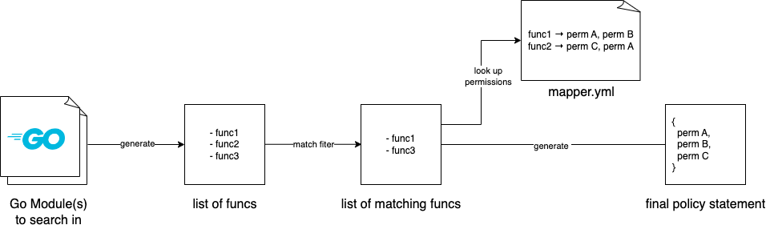

# Permission Generator

Permission generator is a little tool to generate policy statements based on the funcs being used in provider libraries. For example you can use it to generate an AWS policy statement for your code that only requires minimal permissions. It is mostly intended to run in CI or when you update code that uses AWS SDKs.

Example usage:

```sh
# running this from anywhere inside the KKP repo...
permission-generator --provider=aws "k8c.io/kubermatic/v2/pkg/provider/cloud/aws,github.com/kubermatic/machine-controller/pkg/cloudprovider/provider/aws" "github.com/aws/aws-sdk-go-v2/*"

# ...will return something similar to this
{
  "Version": "2012-10-17",
  "Statement": [
    {
      "Effect": "Allow",
      "Action": [
        "iam:AddRoleToInstanceProfile",
        "iam:CreateInstanceProfile",
        "iam:DeleteInstanceProfile",
        "iam:GetInstanceProfile",
        "iam:RemoveRoleFromInstanceProfile",
        "iam:TagInstanceProfile"
      ],
      "Resource": "arn:aws:iam::YOUR_ACCOUNT_ID:instance-profile/*"
    },
    {
      "Effect": "Allow",
      "Action": [
        "iam:CreateRole",
        "iam:DeleteRole",
        "iam:DeleteRolePolicy",
        "iam:DetachRolePolicy",
        "iam:GetRole",
        "iam:ListAttachedRolePolicies",
        "iam:ListRolePolicies",
        "iam:PutRolePolicy",
        "iam:TagRole"
      ],
      "Resource": "arn:aws:iam::YOUR_ACCOUNT_ID:role/*"
    },
    {
      "Effect": "Allow",
      "Action": [
        "ec2:AuthorizeSecurityGroupIngress",
        "ec2:CancelSpotInstanceRequests",
        "ec2:CreateSecurityGroup",
        "ec2:CreateTags",
        "ec2:DeleteSecurityGroup",
        "ec2:DeleteTags",
        "ec2:DescribeAvailabilityZones",
        "ec2:DescribeImages",
        "ec2:DescribeInstanceTypeOfferings",
        "ec2:DescribeInstanceTypes",
        "ec2:DescribeInstances",
        "ec2:DescribeRegions",
        "ec2:DescribeRouteTables",
        "ec2:DescribeSecurityGroups",
        "ec2:DescribeSubnets",
        "ec2:DescribeVpcAttribute",
        "ec2:DescribeVpcs",
        "ec2:RunInstances",
        "ec2:TerminateInstances"
      ],
      "Resource": "*"
    }
  ]
}
```

## How does it work

Permission Generator parses the Go AST for the supplied go modules. It then generates a unique list of all funcs that match the supplied REGEX. Afterwards it checks with a yaml-mapper which permissions are being required for each func and creates a flattened policy out of it. Flattened refers to the smallest amount of rules in this case.



## Troubleshooting

Occasionally you will run into a situation where you add new funcs, which are not in the mapper yet. In this case you will receive an error:

```txt
mapper could not find permissions for func abc from module xyz
```

In these cases you have to update the defaultmapper.yml to include the new funcs. In order to make it easier to find all the funcs you can use the `--printFuncs` flag to display all funcs that are being used:

```sh
permission-generator --provider=aws --printFuncs "k8c.io/kubermatic/v2/pkg/provider/cloud/aws,github.com/kubermatic/machine-controller/pkg/cloudprovider/provider/aws" "github.com/aws/aws-sdk-go-v2/*"
```
