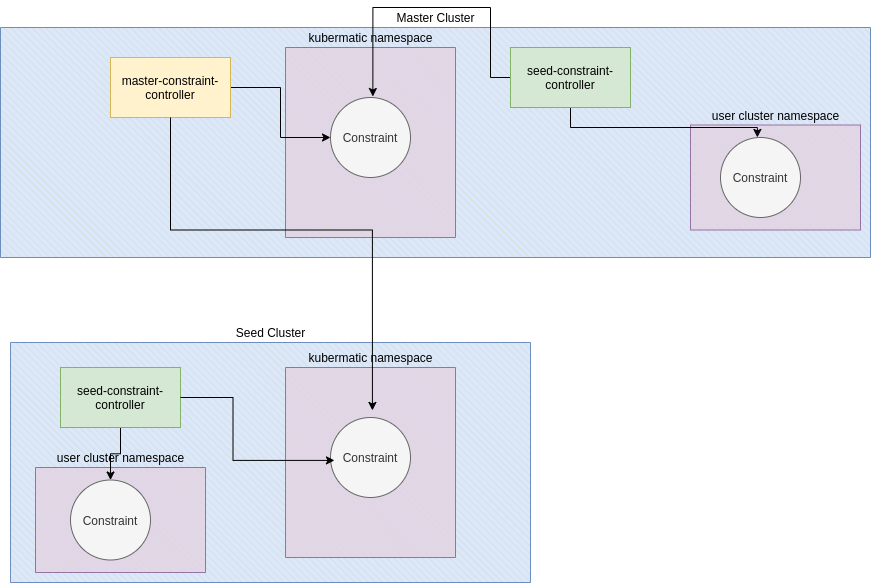

# Default OPA Constraints

**Author**: Lovro Sviben (@lsviben)

**Status**: Draft proposal

## Motivation and Background

The goal is to allow admins to manage default OPA Constraints which would be applied to all or selected OPA-enabled user clusters.
This would allow admins an easier way to make sure all user clusters are following some policies (for example security), instead of the current way in which Constraints need to be created for each cluster separately.

As Constraints need Constraint Templates to function, we need default Constraint Templates and we could ship Kubermatic already with some default ones. 

## How it currently works

Currently Kubermatic clusters dont have any default Constraint Templates or Constraints.
To have a Constraint on a user cluster, firstly an admin needs to create a Constraint Template and then the user cluster admin can create Constraints for it in its user cluster. 

## How to implement default constraints

The default constraints are managed by admins, meaning that they are created in the master cluster. This means that we will 
need to sync them to the seed clusters with a controller. 

Secondly, they should be created in a neutral namespace, probably best our `kubermatic` namespace, and we need a seed-level controller which 
would sync them to the user cluster namespaces present on the seed cluster in which OPA is enabled.

For Constraint Templates we dont have to worry about this, because they are cluster-scoped resources and the master->seed->user cluster syncing is already implemented.

Simplified picture of architecture:

  

So the workflow would be like this:

1. Kubermatic operator/admin creates a Constraint Template in the admin panel, it gets propagated to seed clusters and user clusters with OPA-integration
2. Kubermatic operator/admin creates a default Constraint using the Constraint Template above, it gets created in the `kubermatic` NS of the master cluster and gets propagated to the `kubermatic` namespace of all seed clusters.
3. The seed-level Constraint controller propagates the default Constraint from the `kubermatic` namespace to the user cluster namespaces.
4. The rest is taken care of the already existing Constraint-Syncer in the user-cluster-controller.

Some rules: 

1. Deleting a default constraints deletes it for all clusters that have it. 
2. Cluster admins cannot delete or edit a default constraint in their cluster.

To enable this, we need to differentiate the "default" Constraints from the regular ones, which can be achieved
by adding a `default: true/false` field to the spec. 

### Possible EE features

1. Activate/Deactivate flip on the Constraints. Instead of deleting Constraints, add a feature to deactivate the Constraint. 
Either on the admin level if its a default constraint, or on the cluster level for the cluster admins.
   
2. Filtering for default Constraints. Add filters similar to the ones for the Constraint Template, so admins can set Constraints to target
only some clusters. 
   
3. Ship Kubermatic with already created popular Constraint Templates and Constraints(deactivated). For example for PSP

## Tasks & Effort

- controller for Constraint master->seed syncing (3d)
- controller for Constraint seed kubermatic ns -> user cluster ns syncing (3d)
- endpoints for admin management of Constraints (6d)
- UI for admin panel (??)
- add e2e tests (2d)

### EE

- activate/deactivate (4d) + UI changes (?)
- filtering (3d) + UI changes (?)
- Ship Kubermatic with default CTs and Constraints (?)
