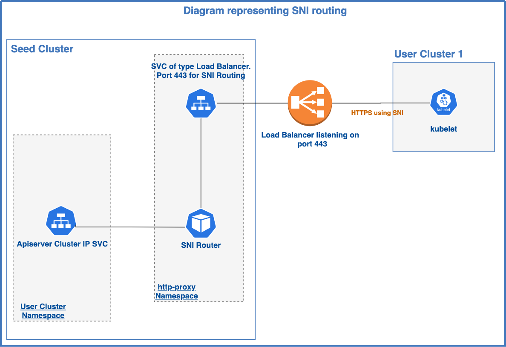
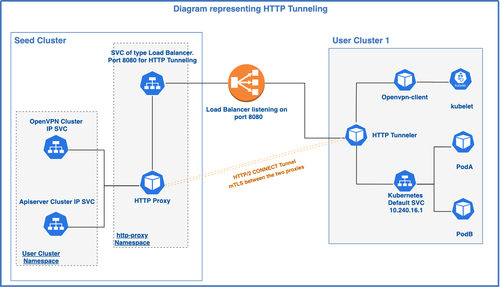

# Exposing control-plane services using SNI and HTTP tunneling

Author: Youssef Azrak (@youssefazrak), Iacopo Rozzo (@irozzo-1A)

Status: Draft proposal.


## Goals

Currently the control plane services running on the seed clusters can be exposed to the worker nodes relying on the strategies described in [this][k8c_expose_strategies] document.

The main goal of this proposal is to provide a new strategy that routes the traffic to the target service based on SNI and HTTP Tunneling.


## Motivation and Background

There are two main points we want to address with this proposal:

*   Reduce cost by using only one Load Balancer.
*   AWS default quota: 50 Load Balancer per region and 50 listener per Load Balancer.


User clusters rely on kubernetes default service to access the API server. Moreover services of type externalName are not currently supported (see [this][k8s_service_issue] issue), thus we have to rely on an IP address.

Depending on the expose strategy in Kubermatic, we can either set up an endpoint IP to be hitting a Load balancer or a seed cluster node directly. The latter is called “NodePort strategy” and brings limitations: Usually those IPs are not static and if a node fails, there is no guarantee that it will be replaced by a new one having the same IP. Hence breaking the communications between the user clusters and their control plane.

To overcome this limitation, we have two strategies that rely on load balancers.

The first one: “Global LoadBalancer” is using one entry point and is routing requests based on ports uniquely assigned in the nodeport range for each user cluster service (apiserver and openvpn). One downside of this approach is having a limited number of listeners on the cloud load balancer. In AWS, there is a limit of 50 listeners per ELB (ALB or NLB) which means 50 services. As we are using 2 services per user cluster this leads to a maximum of 25 user clusters per load balancer. Another downside is that each service consumes two node ports, which could lead to exhaustion of the node port ranges for large clusters (e.g. default nodeport range is 30000-32767 meaning ~700 user clusters).

This leads us to the second load balancing strategy: “One Load Balancer Per User Cluster”. The downside of this solution is cost related. The cost of the load balancers increases linearly with the number of user clusters.

The services to be exposed to user clusters are:


*   Kube Apiserver: HTTPS without the ability to always rely on SNI since pods use the clusterIP of the kubernetes service in the default namespace to access the control plane.
*   OpenVPN server: OpenVPN protocol based on TLS and as the previous one, we can’t rely on SNI.

## Implementation

### Nodes Bootstrap


When a user-cluster node is added, the Kubelet needs to communicate with the Kube Apiserver in order to obtain a certificate and register itself (i.e. the node).

For this communication, we can rely on SNI to route the traffic to the Apiserver as the Kubeconfig used by the Kubelet contains a URL. The only requirement for this scenario is a load-balancer capable of routing the traffic based on SNI (i.e. SNI Router in the diagram below) without terminating the TLS connection. Note that terminating the TLS connection is also possible but that would add some overhead (e.g. certificate management).

The SNI load-balancer is exposed by a service of type LoadBalancer on port 443. This is the approach commonly used by ingress controllers.


<div style="text-align:center">
  
</div>


### Accessing the Kube Apiserver through the Kubernetes service

Pods that need to communicate with the Apiserver normally rely on the KUBERNETES_SERVICE environment variable that contains the cluster IP of the kubernetes service in the default namespace. As we already anticipated in this scenario, we cannot rely on SNI as the client will use the IP directly. In order to bypass this limitation, the TCP traffic is encapsulated in an HTTP tunnel based on CONNECT method, that can be routed based on the host header ([HTTP1.x][http_upgrade_tls_rfc]) or the authority header ([HTTP2][http2_connect_rfc]).

Two components are needed to achieve that:

*   HTTP Tunneler: It receives the TCP connection and encapsulates the traffic using the HTTP CONNECT method. It is deployed as a DaemonSet on the user cluster and uses the host network.
*   HTTP Proxy: It receives the traffic from the HTTP Tunneler and forwards it to the destination specified in the host/authority header. Basically, this will be the Apiserver ClusterIP service on the control plane namespace.

Note that the TLS connection is not terminated either by the HTTP Tunneler nor the HTTP Proxy.

Note that no service of type NodePort is required anymore with this strategy.

In order to intercept the traffic from the PODs, we have two solutions:

*   Iptables rules that redirect the traffic to the HTTP Tunneler.
*   IPVS (see [this][k8s_ipvs_deep_dive] document for more details about ipvs
    usage in Kubernetes)

Note that we cannot configure Kubernetes service endpoint to send the traffic directly to the HTTP Tunneler as localhost and link local addresses are not supported in this case. Moreover the Kubernetes default service can’t be of the type ExternalName.


### Accessing the Kubelet from the Apiserver through the Openvpn tunnel

Apiserver needs to communicate with the Kubelet on the user cluster nodes when using commands like “kubectl logs” or “kubectl exec”. Routing of traffic follows the same steps as the previous section. Openvpn will send the traffic to the HTTP Tunneler. This will get forwarded to the HTTP Proxy that routes it, thanks to the authority header, to the final Openvpn-server ClusterIP service.


<div style="text-align:center">
  
</div>

### Setup involving a corporate HTTP Proxy

In case worker nodes do not have direct internet access but have to pass
through a corporate HTTP proxy (we will call it middle HTTP proxy in the rest
of the document), we need to configure the HTTP tunneler to send traffic to the
middle HTTP proxy first.

There are two ways of achieving this:

* Configuring the middle HTTP proxy to forward the connect requests addressed
    to the seed HTTP proxy. This strategy is not transparent to the middle HTTP
    proxy and requires some specific configuration.
* Having double CONNECT encapsulation like depicted below:
    ```
    Pod-->[HTTPS]-->HTTP Tunneler--[HTTPS tunneled over HTTP/2 tunneled over HTTP/1.1]-->Middle HTTP Proxy-->[HTTPS tunneled over HTTP/2]-->Seed HTTP Proxy--[HTTPS]-->Kube Apiserver/Openvpn
    ```
    The advantage of this solution is that it does not need specific
    configuration in the middle HTTP proxy.

### Security considerations

> A generic TCP tunnel is fraught with security risks. First, such
> authorization should be limited to a small number of known ports.
> The Upgrade: mechanism defined here only requires onward tunneling at
> port 80. Second, since tunneled data is opaque to the proxy, there
> are additional risks to tunneling to other well-known or reserved
> ports. A putative HTTP client CONNECTing to port 25 could relay spam
> via SMTP, for example.
> -- <cite>[rfc2817][http_upgrade_tls_rfc]</cite>

The HTTP Proxy on seed cluster must only accept CONNECT requests addressed to
the OpenVPN server and Kube Apiserver, all other requests should be dropped.

Moreover and to prevent disclosure of information sent in cleartext between the
CONNECT requests, we have implemented mTLS between the two Envoy pods
(HTTP Tunneler on the user cluster and HTTP Proxy on the seed cluster).

## Alternatives considered

*   Using SNI everywhere: in this case, we would use the OpenVPN3 client instead of OpenVPN2 client. This one supports SNI. The problem we encounter is that OpenVPN uses the OpenVPN protocol which is based on TLS. In OpenVPN protocol the ClientHello is not the first packet exchanged after the TCP handshake, thus standard SNI routers cannot be used. This behaviour has been tested with Nginx ingress controller and Envoy.
*   Making the nodePort expose strategy more robust by introducing a controller that randomly assigns a predefined public IP to one of the seed cluster nodes. In case the selected node fails, the controller will take care of assigning the IP to another node. This means that the controller should be able to perform health checks. The main downside of this approach is that it does not generalize very well, as the logic to attach the public IP to the seed cluster nodes is provider specific.  The other minor negative point is that each service still requires a node port.

## Task & effort:

*   HTTP Tunneler (including controller) - O(10d)
*   HTTP Proxy (including controller) - O(10d)
*   Logic to intercept the traffic targeting the Kubernetes service - O(10d)
*   k8c controllers changes to apply the required manifests - O(10d)
*   Adding new expose strategy and documenting - O(2d)
*   E2E testing - O(10d)

[k8c_expose_strategies]: https://docs.kubermatic.com/kubermatic/main/tutorials-howtos/networking/expose-strategies/
[k8s_service_issue]: https://github.com/kubernetes/kubernetes/pull/47588
[k8s_ipvs_deep_dive]: https://kubernetes.io/blog/2018/07/09/ipvs-based-in-cluster-load-balancing-deep-dive/
[http2_connect_rfc]: https://tools.ietf.org/html/rfc7540#section-8.3
[http_upgrade_tls_rfc]: https://www.ietf.org/rfc/rfc2817.txt
