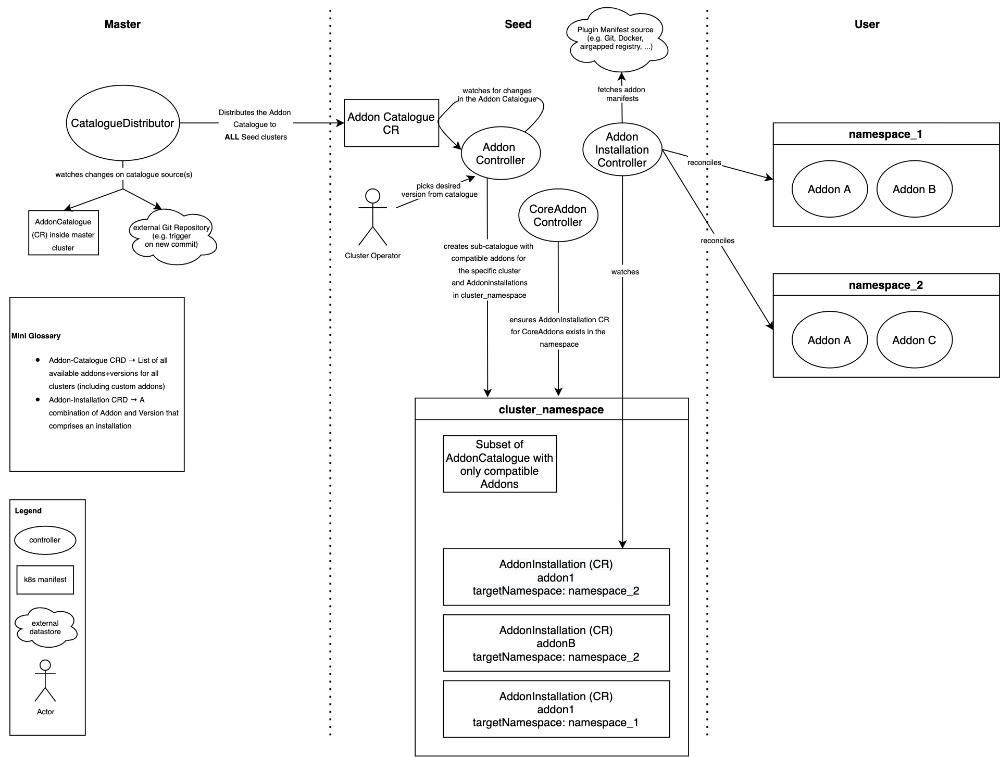
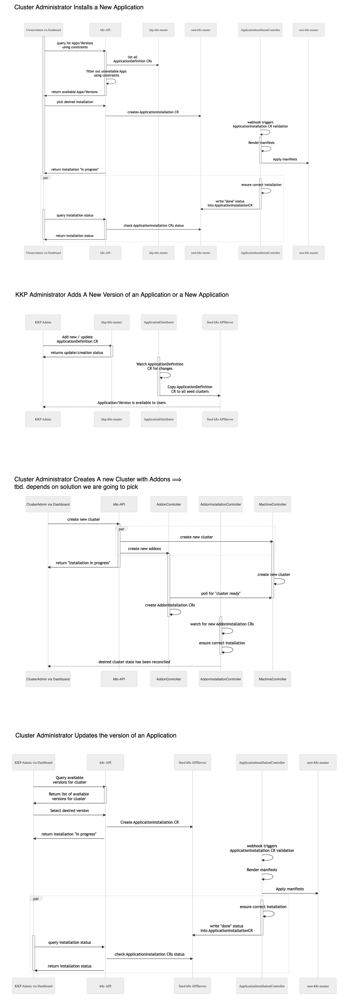

# User Cluster Applications

**Author**: @vgramer @SimonTheLeg

**Status**: Proposal

## Table of Contents

- [User Cluster Applications](#user-cluster-applications)
  - [Table of Contents](#table-of-contents)
  - [Introduction](#introduction)
  - [Motivation and Background](#motivation-and-background)
  - [Goals](#goals)
  - [Non-Goals](#non-goals)
- [Implementation](#implementation)
  - [Architecture](#architecture)
  - [Components](#components)
    - [ApplicationDistributor](#applicationdistributor)
    - [ApplicationDefinition CR](#applicationdefinition-cr)
    - [Updates to KKP API](#updates-to-kkp-api)
    - [ApplicationInstallation CR](#applicationinstallation-cr)
    - [ApplicationInstallationController](#applicationinstallationcontroller)
  - [Common User Flows](#common-user-flows)
  - [Alternatives considered](#alternatives-considered)
- [Glossary](#glossary)
  - [Default Addon](#default-addon)
  - [Application](#application)
  - [Application by Kubermatic](#application-by-kubermatic)
- [Task & effort](#task--effort)

## Introduction

This proposal introduces an improvement for the installation of applications in user-clusters. It aims to replace the current [Custom Addons](https://docs.kubermatic.com/kubermatic/v2.18/guides/addons/), which are applications a user can install on their own. It will not change the installation process for Default Addons, which are provided by Kubermatic. In order to have a clear distinction between the two, this proposal uses the following terminology hereafter:

- Application *(new)* -> Optional component that can be installed by the user in their user cluster
- Default Addons -> Mandatory component that is provided by Kubermatic using the existing Addon mechanism

With Applications we aim to provide an easy way for user to install components into their cluster.

## Motivation and Background

Currently, KKP only supports one mechanism for customers to install components in user-clusters: Custom Addons. For this, all addons are stored in a single docker image that is configured in KKP. Afterwards, an initContainer is being run that starts the image and copies all addons onto the seed-controller-managers local file-system. From there, addon manifests are being rendered and rolled out to user clusters.

The current implementation of addons has some flaws for installing custom components that make the usage and maintenance cumbersome for cluster administrators:

- To add Custom Addons, the cluster-admin needs to bundle manifests and templates in a Docker image that is based on the official addon-manifest docker image by Kubermatic
- It’s currently only possible to deploy multiple instances of the same addon when using a workaround (creating two separate addons)
- Addons are strictly tied to KKP versions due to the composition logic of the manifest image tag; for any provided manifest image the tag gets overwritten with `:<KKP VERSION>\[-CUSTOM SUFFIX\]`
- Complex Addons can leave a trail of reconciliation errors until successfully deployed because all manifest files are applied at the same time
- Creating a cluster is a two-step process; firstly you have to create a cluster and only  afterward you can select custom Addons

*note: PS team report that some customers are using weekly KKP update in dev environments, consequently they need to rebuild the addon image every week which is painful and error-prone.*

## Goals

- Decouple installation of Applications from KKP releases
- Be able to choose which Application should be installed during the cluster creation or in the cluster template
- Ensure Application is installed in user-cluster (reconciliation)
- The list of possible Applications to install should be administered by the KKP platform admin
- Be compatible with private registries in preparation for future air-gapped environment stories. The current Policy regarding the air-gapped environment is to assume a private trusted registry is available. Application Source (manifest of the workload to deployed) and workload images of the application should be configurable to point on a private registry
- Allow for easy management of multiple Application versions
- Allow use of manifests provided by the k8s community

## Non-Goals

- The intent is not to invent a whole new package manager. Therefore dependency management outside an Application is currently out of scope
- Handle installation of  "Application" cross user-cluster (e.g. service-mesh or queuing system). These are considered as "Extensions" and should be handled by [KubeCarrier](https://docs.kubermatic.com/kubecarrier)
- Notifying users if a new version of an application is available or showing in the UI that a new version of an installed application is available. While we think this is quite valuable for end-users, we have decided to leave this out for know in order to keep proposal scope manageable. The good news is that the core principles of this proposal will make it possible to implement this feature later on. It is definitely a feature that should be on roadmap for applications after the implementation of this proposal is done
- Adding kustomize as a rendering method. We did have a longer discussion to decide which rendering methods should be included in the first version. In order to keep the size of this proposal manageable, we have decided to postpone adding kustomize as a rendering method. It is definitely a feature that should be on roadmap for applications after the implementation of this proposal is done and should fit right in the current architecture
- Generic Pull from object storage. It is definitely a feature that should be on roadmap for applications after the implementation of this proposal is done and should fit right in the current architecture. We have made this decision after consulting with PS. It was decided to go implement Git as an external source first, as this is going to reach the majority of customers
- Reworking of the [dashboard into an addon](https://github.com/kubermatic/dashboard/issues/3666). As the dashboard is currently a Default Addon, this proposal is not going to simplify the implementation of #3666. One possibility that can be evaluated is to convert the dashboard into an application. However we need to be aware that this makes the dashboard and optional component
- Handling Logos. The previous version for addons allows to base64 encode logos into the CR for display in the UI. Currently there are some size concerns raised by @kubermatic/sig-api and @kubermatic/sig-ui. In order to move forward, we have decided to exclude logos for now, until a KKP wide solution has been found. However it should be no problem with the current architecture to add them later on. Either as base64 encoded field or a reference to an external source
- Renaming the term 'Default Addons'. There has been a lot of discussion if the old term "Default Addon" was ever a good fit. While there are good arguments to rename this for the future, we have decided to not tackle the renaming in this proposal

# Implementation

## Architecture

See below for a high level architecture view. Each component will be explained in detail in the subsequent chapters of this proposal.



([source](https://app.diagrams.net/#G1drryGHt2MbCDY6wRz99u7lMSBYXgI2lH))

## Components

### ApplicationDistributor

The ApplicationDistributor resides in the master cluster. Its main job is to distribute ApplicationDefinition CRs into different seed clusters. We have decided to create a separate component for this, so there is a single source of truth on available Applications, which can be synced across multiple seed clusters.

In order to work properly, the ApplicationDistributor must (dynamically) be able to discover all available SeedClusters, so it knows where to push the ApplicationDefinitions to.

In the case of the MasterCluster and SeedCluster being the same, we propose to still run the ApplicationDistributor exactly the same. Concretely this means it would have one target seed cluster (itself) and create a merged catalogue for it. This would have the advantage, that in case customers decide to add new seed clusters, the new seed clusters would work right out-of-the-box. Additionally, this helps keeping the code generic, which is in line with KKPs development pattern.

Furthermore, the ApplicationDistributor ensures that there are no duplicate Applications. A duplicate is defined by two Applications having the same `name` and `version`. We propose to protect against accidental duplicates using a ValidationWebhook.
Lastly, we envisioned two possible sources for a ApplicationDefinitions:

- watching for changes of ApplicationDefinition Custom Resources directly inside KKP master
- watching a git repository → this idea was developed from PS feedback. It would enable customers to manage their applications in a GitOps way

  *tbd:  Alternatively to achieve GitOps, it would also be possible to have a CI/CD pipeline directly update the ApplicationDefinition CRs in the master cluster. We are currently unsure if this is better or worse. We have decided to offload this decision to the implementation phase*

### ApplicationDefinition CR

- contains all versions for an application
- each version has
  - template
    - a rendering method. All methods will automatically inject [template data](https://docs.kubermatic.com/kubermatic/v2.18/guides/addons/#manifest-templating) into the values. Possible methods are (additional methods can easily be added in the future):
      - helm → rendering of helm charts
      - *tbd: Now that we removed go-templates should we offer other methods?*
    *tbd: do we still want to have formFields in the UI or could another way be to have a mini-yaml editor, that allows changing values. This would have the advantage that we can also offer nested values to be overwritten*
    - formSpec → Similar to the current formSpec. It is important to know that this value overwrites any other value store (e.g. helm's values.yaml):
      - displayName →Name in the UI
      - internalName →Templating reference. Allows for nested values using the dot-syntax. For example, if you want to overwrite a values.yaml file, you could do `internalName: spec.replicas`
      - type →Type of the field. We propose that references for now can only be primary types (number, string, ...), but do not allow for nested types (e.g. objects). This makes rendering them a lot more convenient
      - (optional) helpText →helpText to be displayed in the UI
  - a source from where to pull the data from. Possible sources are:
    - git → a git repository from which to pull the manifests. This was considered to be especially useful by Kubermatic PS who work directly with customers
    - helm → a helm repository to pull charts from. Only compatible with rendering method helm
  - constraints. These describe conditions that must apply for an add-on to be compatible with a user cluster. Possible constraints are:
    - kkp-version → semVer range that describes compatible KKP versions
    - k8s-version → semVer range that describes compatible k8s versions
  - values → These are values that can be used for overwriting defaults. We think this field will be required for Application if a customer is using a private registry. So application can be configured

An example CR could look like this:

```yaml
apiVersion: kubermatic.k8c.io/v1
kind: ApplicationDefinition
metadata:
 name: prometheus-node-exporter
spec:
  description: "The Prometheus Node Exporter exposes a wide variety of hardware- and kernel-related metrics."
  versions:
    - version: "v1"
      template:
        method: helm
        formSpec:
          - displayName: Replicas
            internalName: spec.replicas
            required: true
            type: number
            helpText: "Number of replicas."
          - displayName: Description
            internalName: desc
            required: false
            type: text
        source:
          type:
            helm:
              # helm related params...
        constraints:
          kkpVersion:
          k8sVersion:
    - version: "v2"
      template:
          method: helm
        source:
          type: git
            # git related params...
        constraints: # omitted for clarity
```

Note on CRDs in general: The ApplicationDefinition strongly benefits from [OpenAPIv3's `oneOf` functionality](https://swagger.io/docs/specification/data-models/oneof-anyof-allof-not/), which is supported by Kubernetes. For example in the yaml above, you could say a source must be `oneOf` `docker` or `git`. The cool thing about `oneOf` is that `docker` and `git` can have totally have different fields from each other, but still would be statically validated. However, syntax like this is [not yet supported in kubebuilder](https://github.com/kubernetes-sigs/controller-tools/issues/461), which we use to generate the CRDs. Nonetheless, we would still propose to use kubebuilder for now as the advantages of an automated generation outweigh the downside of not being able to do oneOf (yet).

### Updates to KKP API

- adding an endpoint to list compatible Applications given a set of constraints (eg k8s version). This will be required to make it possible for users to select applications in the cluster wizard (see #6000)
- creating ApplicationsInstallations for each user cluster. It is important to note that it only creates the CRs which Application should be installed in which cluster, but does not do the installation of the Application itself (this task will be done by the ApplicationInstallationController).

Fulfilling the aforementioned actions during cluster creation, is a bit more tricky. Currently our process looks like this:

1. FrontEnd sends all params to the CreateEndpoint
2. Create Endpoint uses the params to create the cluster object
3. Seed controller gets informed about a new cluster object
4. Seed controller creates the `cluster-xxx` namespace in the seed cluster and so on...

This means that the namespace where ApplicationInstallations should be stored gets created much later than the CreateEndpoint call. Additionally the namespace also gets created asynchronously and there is no guarantee at which point in time it is ready.

*tbd: As a result of this complexity we thought of two options:*

a) Create ApplicationCRs directly inside the cluster object and then have the ApplicationInstallationController watch the cluster CR

- we would extend the cluster object with an Applications field that contains a list of all Applications and their values
- the ApplicationInstallationController would watch the cluster CR and create corresponding ApplicationInstallation CRs

This implementation is close to the status quo of packing everything into the cluster object and then react to it. However we have the concern that the sum of all ApplicationInstallations with all of its fields can become quite large and result in a too large cluster object

b) Create CRs directly during cluster creation

we would extend the `CreateEndpoint` func to:

- create the seed-namespace right after the cluster object has been created. We need to make sure this early creation does not interfere with the seed-controller
- create the application CRs after the namespace has been created

This option would keep the cluster-object in its current size. However we are currently not sure if there are any implications from creating the namespace early. We think this will have no implication for cluster templates, as they are based on the selected UI values, which would contain the Application information.

Implementation Hint: In any case (a or b) we also have to update the validation cluster method to ensure applications are valid.

### ApplicationInstallation CR

- contains a mapping of a specific Application and cluster where to install
  - the Application is specified by an ApplicationRef. Currently, this consists of a name and version
  - the cluster where to install is specified by the namespace the ApplicationInstallation was created in (`metadata.namespace`) => the clusterID must be passed to k8c-api
- contains the merged values that are being passed for the installation. This is needed as customers can set custom values for each installation.

```yaml
apiVersion: kubermatic.k8c.io/v1
kind: ApplicationInstallation
metadata:
  name: prometheus
    namespace: cluster-47s2ddlfgj
spec:
  targetNamespace: monitoring
  createNamespace: true # flag to create the targetNamespace
  applicationRef:
    name: prometheus
    version: v1
  values: # Both structure and values depend on what is configured in the application
    abc: xyz
```

### ApplicationInstallationController

The ApplicationInstallationController resides in the seed cluster. Its main purpose is to watch ApplicationInstallation CRs and ensure that the requested Applications are installed/modified/deleted in the corresponding user clusters. By extension of this, the ApplicationInstallationController needs to be able to fetch the manifests for Applications.

The functionality of the ApplicationInstallationController depends on the selected `source` and `method` in the ApplicationInstallation CR. To start we propose the following sources and methods:

**Sources**

*git*

- external git repository to pull from
- for this source, the ApplicationInstallationController runs a git checkout from a remote repository
- spec:
  - remote →URL of the git repository
  - ref →git ref (e.g. branch, commit, sha, ...)
  - path →local file path. This is useful as it allows users to use one git repository for multiple Applications
  - auth →can be configured to be pulled from a k8s secret (e.g. ssh-key, user-pw)
- Note: we have considered offloading the spec into a separate CR (e.g. ApplicationRegistry). However, we noticed that it might not be desirable to have ref and path in a separate CR, as you most likely want these to be different for different Applications/versions. For the remaining remote and auth, we think it is not worth the extra effort to offload them.

*helm*

- external helm repository to pull from
- only compatible with method helm
- spec:
  - url → url of the helm repository
  - repository name → will be automatically created by the ApplicationInstallationController to ensure the name is unique per url
  - chart → name of the helm chart
  - chart version → version of the helm chart
  - auth →authentication. Currently, only user-pw is [supported by helm](https://helm.sh/docs/topics/registries/#auth).

**Methods**

*helm*

- helm release of a helm chart
- the ApplicationController pulls the corresponding chart and runs a helm installation/modification/deletion
- spec:
  - name → name of the helm release
  - values →override of values. Uses helms standard `values.yaml` override
- we propose to use helm's build in dependency mechanism and not build any custom logic around it

*note: the \[TemplateData\](*[*Applications - Kubermatic Documentation*](https://docs.kubermatic.com/kubermatic/v2.18/guides/addons/)*) is passed as an additional value to helm*

## Common User Flows


\
([source](https://app.diagrams.net/#G1drryGHt2MbCDY6wRz99u7lMSBYXgI2lH))

## Alternatives considered

- building our own package manager. The idea behind this was that we could also solve  the issue of having complex packages with dependencies. We have decided against this as it would require significant effort to implement, which is not worth it for this single feature. Additionally using for example helm also offers a basic variant of [handling dependencies](https://helm.sh/docs/chart_best_practices/dependencies/)
- there has been [previous work](https://github.com/kubermatic/kubermatic/blob/master/docs/proposals/platform-extensions.md#competitive-landscape) done on considering KubeApps, Flux, OLM, and Kyma for this task
- building an installation mechanism for Default as well as Custom Addons. This was the [original](https://github.com/kubermatic/kubermatic/pull/8125) idea for this proposal. We decided to move a way from this due to the following factors:

  - Default Addons are distinct from Custom Addons and often require other components outside of the user cluster (e.g. kube-metrics)
  - We decided that decoupling Default Addons from KKP versions is very difficult to support. This is because it allows the usage of all combinations of KKP and Addon versions, which are hard to test for us in advance. As a result we could run into a variety of unexpected errors

# Glossary

## Default Addon

A *Default Addon* is installed on all user clusters based on configuration. The user can not delete *Default Addons*. These will remain unchanged after this proposal

- Shipped by Kubermatic,  tied to KKP version
- Tested by Kubermatic (Kubernetes versions)
- Supported by Kubermatic

## Application

An *Application* is an additional component installed in all user clusters on-demand, but not shipped with KKP. It is provided by the customer or a third party (e.g. helm community):

- Shipped by the customer
- Not tested nor supported by Kubermatic
- Could break clusters
- The customer is fully responsible

## Application by Kubermatic

An *OptionalApplication* is installed in a user clusters on demand during runtime or at cluster creation. The user can also uninstall and reinstall them. They are visible in the KKP UI.

- Shipped by Kubermatic, tied to KKP version (KKP version will be enforced using the aforementioned constraint feature)
- Tested by Kubermatic (Kubernetes versions and customizations)
- Supported by Kubermatic

*Note: From a technical perspective, Applications and Applications by Kubermatic will be handled the same way. However from a contractual perspective, it is important to differentiate: Applications by Kubermatic are supported by Kubermatic, while regular Applications are not.*

# Task & effort

*Specify the tasks and the effort in days (samples unit 0.5days) e.g.*

- This section will be added as soon as we have worked on creating user-stories
