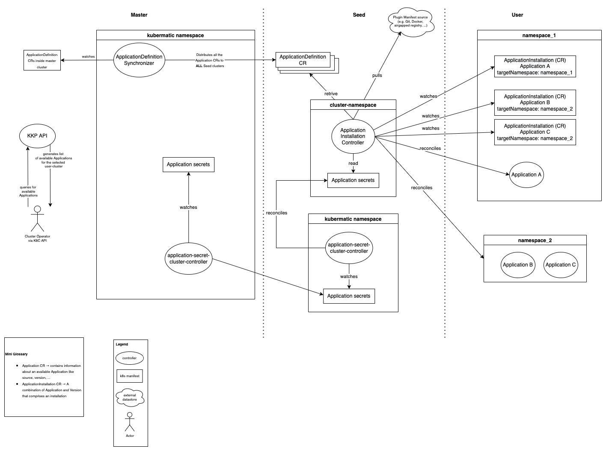

# User Cluster Applications

**Author**: @vgramer @SimonTheLeg

**Status**: implemented KKP 2.21

## Table of Contents
<!-- toc -->
  - [Introduction](#introduction)
  - [Motivation and Background](#motivation-and-background)
  - [Goals](#goals)
  - [Non-Goals](#non-goals)
- [Implementation](#implementation)
  - [Architecture](#architecture)
  - [Components](#components)
    - [Application Definition Synchronizer](#application-definition-synchronizer)
    - [ApplicationDefinition CR](#applicationdefinition-cr)
    - [ApplicationInstallation CR](#applicationinstallation-cr)
    - [Application Installation Controller](#application-installation-controller)
    - [Credentials management](#credentials-management)
    - [Updates to KKP API](#updates-to-kkp-api)
  - [Common User Flows](#common-user-flows)
    - [Cluster Administrator Installs a New Application](#cluster-administrator-installs-a-new-application)
    - [Cluster Administrator Creates A new Cluster with Application](#cluster-administrator-creates-a-new-cluster-with-application)
    - [Cluster Administrator Updates the version of an Application (supported only with kubectl)](#cluster-administrator-updates-the-version-of-an-application-supported-only-with-kubectl)
    - [KKP Administrator Adds A New Version of an Application or a New Application](#kkp-administrator-adds-a-new-version-of-an-application-or-a-new-application)
    - [KKP Administrator remove a Version of an Application](#kkp-administrator-remove-a-version-of-an-application)
  - [Alternatives considered](#alternatives-considered)
- [Glossary](#glossary)
  - [Default Addon](#default-addon)
  - [Application](#application)
  - [Application by Kubermatic](#application-by-kubermatic)
- [Task &amp; effort](#task--effort)
<!-- /toc -->

## Introduction

This proposal introduces an improvement for the installation of applications in user clusters. It aims to replace the current [Custom Addons](https://docs.kubermatic.com/kubermatic/v2.18/guides/addons/), which are applications a user can install on their own. It will not change the installation process for Default Addons, which are provided by Kubermatic. In order to have a clear distinction between the two, this proposal uses the following terminology hereafter:

- Application *(new)* -> Optional component that can be installed by the user in their user cluster
- Default Addons -> Mandatory component that is provided by Kubermatic using the existing Addon mechanism

With Applications, we aim to provide an easy way for users to install components into their cluster.

## Motivation and Background

Currently, KKP only supports one mechanism for KKP admins to install components in user clusters: Custom Addons. For this, all addons are stored in a single docker image that is configured in KKP. Afterwards, an initContainer is run that starts the image and copies all addons onto the seed-controller-managers local file system. From there, addon manifests are being rendered and rolled out to user clusters.

The current implementation of addons has some flaws for installing custom components that make the usage and maintenance cumbersome for cluster administrators:

- To add Custom Addons, the cluster-admin needs to bundle manifests and templates in a Docker image that is based on the official addon-manifest docker image by Kubermatic
- It’s currently only possible to deploy multiple instances of the same addon when using a workaround (creating two separate addons)
- Addons are strictly tied to KKP versions due to the composition logic of the manifest image tag; for any provided manifest image the tag gets overwritten with `:<KKP VERSION>\[-CUSTOM SUFFIX\]`
- Complex Addons can leave a trail of reconciliation errors until successfully deployed because all manifest files are applied at the same time
- Creating a cluster is a two-step process; firstly, you have to create a cluster, and only afterwards you can select custom Addons

*note: PS team report that some admins are using weekly KKP update in dev environments. Consequently, they need to rebuild the addon image every week, which is painful and error-prone.*

## Goals

- Decouple installation of Applications from KKP releases
- Be able to choose which Application should be installed during the cluster creation or in the cluster template
- Ensure Application is installed in the user cluster (reconciliation)
- The list of possible Applications to install should be administered by the KKP platform admin
- Be compatible with private registries in preparation for future air-gapped environment stories. The current Policy regarding the air-gapped environment is to assume a private trusted registry is available. Application Source (manifest of the workload to deploy) and workload images of the application should be configurable to point on a private registry
- Allow for easy management of multiple Application versions
- Allow use of manifests provided by the k8s community

## Non-Goals

- The intent is not to invent a whole new package manager. Therefore a custom dependency management outside an Application is currently out of scope. Users still will be able to use built-in dependency management if the selected method provides it (e.g. helm's dependency management)
- Handle installation of  "Application" cross user-cluster (e.g. service-mesh or queuing system). These are considered as "Extensions" and should be handled by [KubeCarrier](https://docs.kubermatic.com/kubecarrier)
- Notifying users if a new version of an application is available or showing in the UI that a new version of an installed application is available. While we think this is quite valuable for end-users, we have decided to leave this out for now to keep the proposal scope manageable. The good news is that the core principles of this proposal will make it possible to implement this feature later on. It is definitely a feature that should be on the roadmap for applications after the implementation of this proposal is done
- Adding kustomize as a rendering method. We did have a longer discussion to decide which rendering methods should be included in the first version. In order to keep the size of this proposal manageable, we have decided to postpone adding kustomize as a rendering method. It is definitely a feature that should be on the roadmap for applications after the implementation of this proposal is done and should fit right in the current architecture
- Generic Pull from object storage. It is definitely a feature that should be on the roadmap for applications after the implementation of this proposal is done and should fit right in the current architecture. We have made this decision after consulting with PS. It was decided to implement Git as an external source first, as this is going to reach the majority of admins
- Reworking of the [dashboard into an addon](https://github.com/kubermatic/dashboard/issues/3666). As the dashboard is currently a Default Addon, this proposal is not going to simplify the implementation of #3666. One possibility that can be evaluated is to convert the dashboard into an application. However, we need to be aware that this makes the dashboard and optional component
- Handling Logos. The previous version for addons allows to base64 encode logos into the CR for display in the UI. Currently there are some size concerns raised by @kubermatic/sig-api and @kubermatic/sig-ui. In order to move forward, we have decided to exclude logos for now, until a KKP wide solution has been found. However it should be no problem with the current architecture to add them later on. Either as base64 encoded field or a reference to an external source
- Renaming the term 'Default Addons'. There has been a lot of discussion if the old term "Default Addon" was ever a good fit. While there are good arguments to rename this for the future, we have decided to not tackle the renaming in this proposal

# Implementation

## Architecture

See below for a high-level architecture view. Each component will be explained in detail in the subsequent chapters of this proposal.



([source](https://app.diagrams.net/#G1drryGHt2MbCDY6wRz99u7lMSBYXgI2lH))

## Components

### Application Definition Synchronizer

The `Application Definition Synchronizer` controller belongs to the `master-controller-manager`. Its main job is to distribute ApplicationDefinition CRs into different seed clusters. We have decided to create a separate component for this, so there is a single source of truth on available Applications, which is synced across multiple seed clusters.

In order to work properly, the `Application Definition Synchronizer` must (dynamically) be able to discover all available SeedClusters, so it knows where to push the ApplicationDefinitions.

In the case of the master cluster and seed cluster being the same, no synchronization is performed to avoid caching problems with the reconcile framework. For more information, please read comment in [project-synchronizer](https://github.com/kubermatic/kubermatic/blob/c2fa5b3223da4c340850a8e30ec25f7fdff29bea/pkg/controller/master-controller-manager/project-synchronizer/controller.go#L131-L142)

Furthermore, the `Application Definition Synchronizer` ensures that there are no duplicate Applications through a validation webhook. A duplicate is defined by two Applications having the same `name` and `version`.

### ApplicationDefinition CR

ApplicationDefinition contains all versions for an application. Each version has:
- a source from where to pull the data from. Possible sources are:
  - git → a git repository from which to pull the manifests. This was considered to be especially useful by Kubermatic PS, who work directly with admins
  - helm → a helm repository to pull charts from. Only compatible with templating method helm
- values → describe overrides for manifest-rendering. It's a free yaml field.


All applications share the same template method, which defines how to install the application. Possible methods are:
- helm → rendering of helm charts.

*note: the code is extensive to add more [sources](https://github.com/kubermatic/kubermatic/blob/c2fa5b3223da4c340850a8e30ec25f7fdff29bea/pkg/applications/providers/types.go#L34-L40) and [template method](https://github.com/kubermatic/kubermatic/blob/c2fa5b3223da4c340850a8e30ec25f7fdff29bea/pkg/applications/providers/types.go#L54-L62)*

An example CR could look like this:

```yaml
apiVersion: apps.kubermatic.k8c.io/v1
kind: ApplicationDefinition
metadata:
 name: prometheus-node-exporter
spec:
  description: "The Prometheus Node Exporter exposes a wide variety of hardware- and kernel-related metrics."
  method: helm
  versions:
    - version: "v1.0.0"
      template:
        source:
          helm:
            chartName: prometheus
            chartVersion: 15.10.4
            url: https://prometheus-community.github.io/helm-charts
            credentials:
              # helm credentials related params...
    - version: "v0.0.0-dev"
      template:
        source:
          git:
            path: charts/prometheus-node-exporter
            ref:
              branch: main
            remote: git@github.com:prometheus-community/helm-charts.git
            credentials:
            # git credentials related params...
```

For more information about how credentials are managed, please read [credentials section](#credentials-management)

### ApplicationInstallation CR

ApplicationInstallation CRs are created in the user cluster and contain:

- information about the application to install, which is specified by an `ApplicationRef`. Currently, this consists of a `name` and `version`.
- information about the namespace where the application workload is deployed.
- the merged values that are being passed for the installation. This is needed as admins can set custom values for each installation.

An example CR could look like this:
```yaml
apiVersion: apps.kubermatic.k8c.io/v1
kind: ApplicationInstallation
metadata:
  name: prometheus
  namespace: kube-system
spec:
  namespace:
    name: monitoring
    create: true #flag that indicates if namespace have to be created by the controller
    labels:
      # label to apply on the namespace
    annotations:
    # annotations to apply on the namespace
  applicationRef:
    name: prometheus-node-exporter
    version: v1.0.0
  values: # Both structure and values depend on what is configured in the application
    abc: xyz
```

the ApplicationInstallation CRD is installed in the user cluster by the `user-cluster-controller-manager` thanks to the [resources reconciler](https://github.com/kubermatic/kubermatic/blob/c2fa5b3223da4c340850a8e30ec25f7fdff29bea/pkg/controller/user-cluster-controller-manager/resources/reconciler.go#L621-L654)

### Application Installation Controller

The `ApplicationInstallationController` belongs to the `user-cluster-controller-manager`. Its main purpose is to watch ApplicationInstallation CRs and ensure that the requested Applications are installed/modified/deleted in
the corresponding user cluster. By extension of this, the `ApplicationInstallationController` needs to be able to fetch the manifests for Applications. We decided to have the `ApplicationInstallationController` inside `user-cluster-controller-manager` as opposed to having it in the user-cluster for the following reasons:

1. Secret Management -> the `ApplicationInstallationController` handles secrets to external sources (e.g. git credentials). As a result, we did not want to:
  * replicate these secrets into every user cluster or
  * build a mechanism for user-cluster-controllers to read secrets from the seed cluster and store them internally
2. Better support for air-gapped systems -> while there is no finalized concept for doing air-gapped systems yet, we believe that having only `ApplicationInstallationController` from the seed access external resources, is in any case making it easier for future usage with air-gapped systems

The functionality of the `ApplicationInstallationController` depends on the selected `source` and `method` in the `ApplicationDefinition` CR. At the moment, the following sources and methods:

**Sources**

*git*

- external git repository to pull from
- for this source, the `ApplicationInstallationController` runs a git shallow clone from a remote repository
- spec:
  - remote →URL of the git repository
  - ref →git ref (e.g. branch, commit, tag)
  - path →local file path. This is useful as it allows users to use one git repository for multiple Applications
  - credentials →can be configured to be pulled from a k8s secret (e.g. ssh-key, user-pw)
- Note: we have considered offloading the spec into a separate CR (e.g. ApplicationRegistry). However, we noticed that it might not be desirable to have ref and path in a separate CR, as you most likely want these to be different for different Applications/versions. For the remaining remote and auth, we think it is not worth the extra effort to offload them.

*helm*

- external helm repository to pull from
- only compatible with method helm
- spec:
  - url → url of the helm repository (HTTP and OCI registry are supported)
  - chartName → name of the helm chart
  - chartVersion → version of the helm chart
  - crendentials →authentication to the helm registry (user-pw and registryConfigFile are supported)

**Methods**

*helm*

- helm release of a helm chart
- the `ApplicationInstallationController` pulls the corresponding chart and runs a helm installation/modification/deletion
- spec:
  - values →override of values. Uses helms standard `values.yaml` override

### Credentials management
Source credentials are stored in k8s secrets created in the namespace where Kubermatic is installed (default `kubermatic`) in master cluster. For the rest of the document, we will say `kubermatic` namespace for more clarity.
So master cluster is the source of truth. To be reconciled with seed clusters, these secrets must be annotated with `apps.kubermatic.k8c.io/secret-type` (value does not matter).

The `application-secret-synchronizer` controller belongs to the `master-controller-manager`  and reconciles annotated secrets with all seeds in the `kubermatic` namespace.

The `ApplicationInstallationController` needs to access application secrets to pull the application's source. However, it belongs to the `user-cluster-controller-manager` which has only access to cluster namespace in the seed (e.g. `cluster-z47n6s2w6n`).
For security reasons, we don't give permission to the `user-cluster-controller-manager` to read secrets in the `kubermatic` namespace because it contains sensitive information, especially when the master and seed are the same cluster.
So we have created another controller, the `application-secret-cluster-controller`, which belongs to the `seed-controller-manager` that reconciles annotated secrets in `kubermatic` namespace into the cluster namespace.

### Updates to KKP API

- adding an endpoint to list ApplicationDefintion. It's required to make it possible for users to select applications in the cluster wizard (see #6000)
- adding endpoints to install, edit and remove an application in a user cluster. These endpoints will only create, edit or remove Application CRs in the user cluster. Reconciliation will be performed by `ApplicationInstallationController`.

To do this, the following changes need to be made to the cluster and clustertemplate objects

**cluster**

We choose a similar approach to what we currently do with the `machineDeployment`. Specifically, we would add the new annotation `kubermatic.io/initial-application-installations-request` on the cluster object, which contains a list of all Applications CR to install. It's necessary to initially store this in cluster object, so a user can set Applications directly at cluster creation and save it in cluster template. To alleviate the size issue,we use a clean-up mechanism like the `machineDeployment` has.

This logic is implemented in the `initial-application-installation-controller`, which belongs to the `seed-controller-manager`. When the cluster and the `ApplicationInstallationController` are healthy, it parses the annotation, creates `ApplicationInstallation` CRs in
the user cluster, and removes the annotation. This will reduce bloat on the cluster object.

This might lead to the question: Why use ApplicationInstallation CRs at all? For this, we think having the CR is going to make routine operations (e.g. fetching, updating Applications) much easier and less resource-intensive.

Alternatives considered: We considered the idea of creating CRs directly on the POST call in the api. This theoretically would have the advantage that you would not need to store all Application CR in the cluster object.
We decided to not go with this for the following reasons:

1. The `ApplicationInstallation` CR lives in the user cluster. So we have to wait user cluster to be ready and `ApplicationInstallation` CRD installed to be able to create CR.
2. The option would not allow to use Applications in cluster template as their information only gets passed from the FE directly to the endpoint.

**clustertemplate**

In order to make it possible for users to deploy a cluster with a set of Applications, we need to persist them in the clustertemplate. Unfortunately, we do not see any other way to store a list of `ApplicationInstallation` . As a result, we might have to place a limit on the number of Applications you can have in a template. This is because clustertemplates get stored in a CR, which has the standard k8s size limit of 1MB.

## Common User Flows
### Cluster Administrator Installs a New Application


### Cluster Administrator Creates A new Cluster with Application


### Cluster Administrator Updates the version of an Application (supported only with kubectl)


### KKP Administrator Adds A New Version of an Application or a New Application


### KKP Administrator remove a Version of an Application


## Alternatives considered

- building our own package manager. The idea behind this was that we could also solve  the issue of having complex packages with dependencies. We have decided against this as it would require significant effort to implement, which is not worth it for this single feature. Additionally using for example helm also offers a basic variant of [handling dependencies](https://helm.sh/docs/chart_best_practices/dependencies/)
- there has been [previous work](https://github.com/kubermatic/kubermatic/blob/main/docs/proposals/platform-extensions.md#competitive-landscape) done on considering KubeApps, Flux, OLM, and Kyma for this task
- building an installation mechanism for Default as well as Custom Addons. This was the [original](https://github.com/kubermatic/kubermatic/pull/8125) idea for this proposal. We decided to move a way from this due to the following factors:

  - Default Addons are distinct from Custom Addons and often require other components outside the user cluster (e.g. kube-metrics)
  - We decided that decoupling Default Addons from KKP versions is very difficult to support. This is because it allows the usage of all combinations of KKP and Addon versions, which are hard to test for us in advance. As a result we could run into a variety of unexpected errors
  - We decided to not embed KubeApps for the following reasons:
    - uses a database to store state of the applications. This would lead to additional components we need to ship with KKP, which are not inline with our current architecture principle to store stateful information directly in k8s. Additionally the database would make it more difficult to enable GitOps for Applications natively
    - no time-save on frontend development. After syncing with Product Management it became clear that a re-direct to the KubeApps dashboard is not desirable. Therefore we would need to implement a frontend for KubeApps API
    - more difficult to integrate into cluster-templates in order to achieve clusters with pre-installed apps

# Glossary

## Default Addon

A *Default Addon* is installed on all user clusters based on configuration. The user can not delete *Default Addons*. These will remain unchanged after this proposal

- Shipped by Kubermatic,  tied to KKP version
- Tested by Kubermatic (Kubernetes versions)
- Supported by Kubermatic

## Application

An *Application* is an additional component installed in all user clusters on-demand, but not shipped with KKP. It is provided by the admin or a third party (e.g. helm community):

- Shipped by the admin
- Not tested nor supported by Kubermatic
- Could break clusters
- The admin is fully responsible

## Application by Kubermatic

An *OptionalApplication* is installed in a user clusters on demand during runtime or at cluster creation. The user can also uninstall and reinstall them. They are visible in the KKP UI.

- Shipped by Kubermatic, tied to KKP version (KKP version will be enforced using the aforementioned constraint feature)
- Tested by Kubermatic (Kubernetes versions and customizations)
- Supported by Kubermatic

*Note: From a technical perspective, Applications and Applications by Kubermatic will be handled the same way. However from a contractual perspective, it is important to differentiate: Applications by Kubermatic are supported by Kubermatic, while regular Applications are not.*

# Task & effort

*Specify the tasks and the effort in days (samples unit 0.5days) e.g.*

- This section will be added as soon as we have worked on creating user-stories
