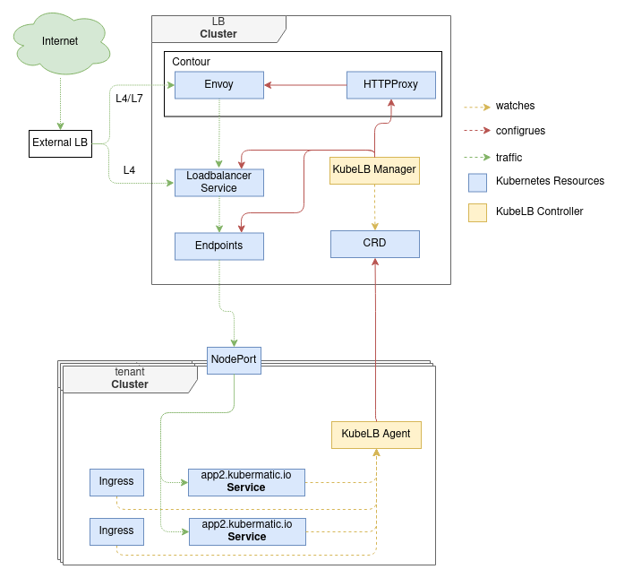

# KubeLB

**Author**: Matthias Osthues

**Status**: Draft proposal; prototype in progress.

## Goals

KubeLB is a provider for multi cluster load balancing and takes the advantages of Kubernetes to do the load balancing. 

## Non-Goals

* Implementation of service type LoadBalancer for single cluster

* ECMP and BGP

* IPv6 support

## Motivation and Background

Kubernetes does not offer an out of the box implementation of load balancers for clusters. The implementations of Network LB & Ingress LB that Kubernetes does ship with are all calls out to various IaaS platforms (GCP, AWS, Azure…). If you’re not running on a supported IaaS platform (GCP, AWS, Azure…), LoadBalancers & Ingress will not get provisioned.
Solutions which are available e.g. MetalLB focus on a single cluster. KubeLB aims to provide load balancing for multiple clusters and takes the advantages of kubernetes itself. 
 
#### Possible features: 

* Implementation of service type LoadBalancer where it's not available

* Multi cluster Ingress Controller

* Possible cost reduction as you can decide between KubeLB and IaaS LoadBalancer instances

* Multi cluster load balancing

* Load balancing for internal networks
 
* In a multi cluster environment it can be useful to have a limited amount of entrypoints (Load balancer cluster) inside the network to do some security or monitoring. 

* Make the actual loadbalancer technology pluggable (easy implementation if e.g. someone wants to use nginx over envoy)

* Be able to have the load balancing cluster exist separately from the seed cluster or integrated into it

## Implementation

The overall implementation contains two different parts: 

**Agent**: Controller which is deployed in every tenant cluster. It watches for Services, Ingress resources and node changes. Updates or Creates a CRD inside the load balancing Cluster accordingly.

**Manager**: Controller which is responsible for deploying and configuring the resources needed inside the load balancer cluster. Watcher for it's CRD which describes the load balancing endpoints and settings. 

<div style="text-align:center">
  
</div>


It is required to have a service type "LoadBalancer" implementation on the load balancer cluster. This can be a cloud solution, or some single cluster implementations listed below. 


#### Envoy & Contour

On the LB cluster Envoy & Contour are installed. When the controller creates a new HTTPProxy resource, Contour will configure Envoy automatically to process the traffic of the domain.
The LB cluster will have a domain assigned e.g. lb.example.com each cluster will have a dedicated subdomain CLUSTERNAME.lb.example.net. For an Ingress on the tenant cluster a subdomain will be created based on the pattern INGRESS.CLUSTERNAME.lb.example.net The user can reference this URL in his DNS as a CNAME for a customer URL e.g. example.com -> CNAME INGRESS.CLUSTERNAME.lb.example.net 
To enable envoy to forward the customer URL, in the Ingress both URLs must set.
Envoy will forward the traffic based on the HTTPProxy to the service and Kubernetes will forward the traffic from the service on the LB cluster to the Endpoints of the tenant cluster. 

This is not necessarily needed for L4 implementation but can be used to reduce costs of external LoadBalancer instances, since the L4 services can share one entrypoint with different ports. So it can be of Type ClusterIP with envoy infront or directly of type LoadBalancer.

#### Implementation L4

The agent watches for Services of type LoadBalancer/NodePort in the tenant cluster. In the tenant cluster itself for each service with type LoadBalancer a NodePort is allocated by default. 
The agent informs the Manager which creates a Service and Endpoint in the LB cluster and adds the node IP addresses of the tenant cluster to the Endpoint IP addresses there. The agent watches for node changes like "remove", "add" and failures and will update the IP list in the Endpoint accordingly.
Evaluation for failing node detection, so it is fast enough and meet our requirements. If not we need to do some active health checks.
 
For IaaS type load balancers: The controller will use the provisioned load balancers endpoint as its own endpoint.
For non implemented type load balancers: The controller will update the Status and IP of the Service in the tenant cluster, when the LB is provisioned or changed.

Kubernetes will forward the traffic from the Service on the LB cluster to one of the endpoint IPs and the port.

Example Configuration LB Cluster:

```yaml
apiVersion: v1
kind: Service
metadata:
  name: hello-svc
spec:
  type: LoadBalancer / ClusterIP 
  ports:
  - protocol: TCP
    port: 80
    targetPort: 80
    name: http
---
apiVersion: v1
kind: Endpoints
metadata:
  name: hello-svc
subsets:
- addresses:
  - ip: 10.0.0.1 #Node-1 address 
  - ip: 10.0.0.2 #Node-2 address
  ports:
  - name: http
    port: 80
    protocol: TCP
```

#### Implementation L7

The agent will watch for the Ingress resource and configures the CRD inside the load balancing cluster accordingly.
The manager will create the Service as described in the L4 Implementation and HTTPProxy resource. This takes the advantage of contour to manage different domains and configure envoy.

On the tenant cluster:
```yaml
apiVersion: extensions/v1beta1
kind: Ingress
metadata:
  name: hello-svc
  annotations:
    kubelb.expose: extern / intern
spec:
  rules:
  - http:
      paths:
      - path: /testpath
        backend:
          serviceName: test
          servicePort: 80
```

For the LB cluster:
```yaml
    apiVersion: projectcontour.io/v1
    kind: HTTPProxy
    metadata:
      name: hello-svc
      namespace: clustername
    spec:
      virtualhost:
        fqdn: INGRESS.CLUSTERNAME.lb.example.net
      routes:
        - conditions:
          - prefix: /
          services:
            - name: hello-svc
              port: 80
    ---
    apiVersion: v1
    kind: Service
    metadata:
      name: hello-svc
      namespace: clustername
    spec:
      type: ClusterIP
      ports:
      - protocol: TCP
        port: 80
        targetPort: 80
        name: http
    ---
    apiVersion: v1
    kind: Endpoints
    metadata:
      name: hello-svc
      namespace: clustername
    subsets:
    - addresses:
      - ip: 10.0.0.1 #Node-1 address 
      - ip: 10.0.0.2 #Node-2 address
      ports:
      - name: http
        port: 80
        protocol: TCP
```
#### TLS and Certificates

Limited to envoy/contour and external load balancer implementations

## Alternatives considered

Single cluster implementation for service type "LoadBalancer"

* [MetalLB](https://metallb.universe.tf/)
* [Porter](https://github.com/kubesphere/porter)
* [KubeViP](https://kube-vip.io/)


Multi cluster networking by GKE with [Anthos](https://cloud.google.com/kubernetes-engine/docs/concepts/ingress-for-anthos) - Cloud only Solution 

