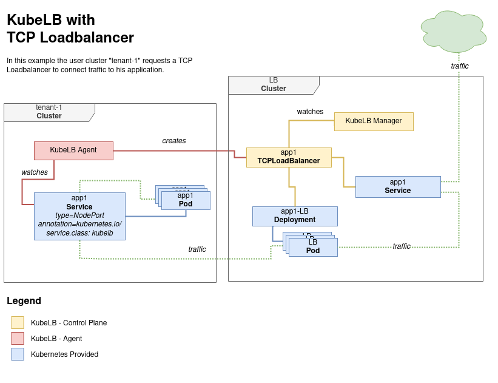
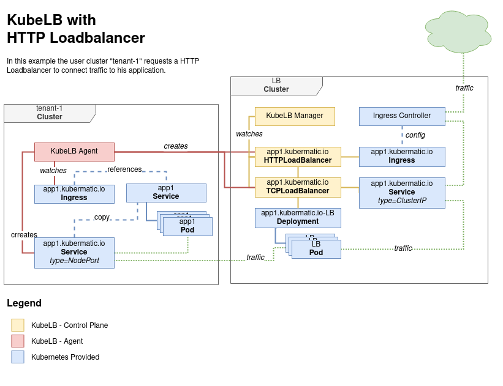

# KubeLB

**Author**: Matthias Osthues

**Status**: Draft proposal; prototype in progress.

## Goals

KubeLB is a provider for multi cluster load balancing and service propagation. 

## Non-Goals

* Implementation of service type LoadBalancer for single cluster

* ECMP and BGP

* IPv6 support

## Motivation and Background

Kubernetes does not offer an out of the box implementation of load balancers for clusters. The implementations of Network LB & Ingress LB that Kubernetes does ship with are all calls out to various IaaS platforms (GCP, AWS, Azure…). If you’re not running on a supported IaaS platform (GCP, AWS, Azure…), LoadBalancers & Ingress will not get provisioned.
Solutions which are available e.g. MetalLB focus on a single cluster. KubeLB aims to provide load balancing for multiple clusters and takes the advantages of kubernetes itself. 
 
#### Possible features: 

* Implementation of service type LoadBalancer where it's not available

* Multi cluster Ingress Controller

* Multi cluster load balancing

* Advanced setups like BGP or similar are only required for the load balancing cluster

* Central external IP Address management

* Possible cost reduction as you can decide between KubeLB and IaaS LoadBalancer instances

* Load balancing for internal networks
 
* In a multi cluster environment it can be useful to have a limited amount of entrypoints (Load balancer cluster) inside the network to do some security or monitoring. 

* Make the actual Ingress Controller pluggable (easy implementation if e.g. someone wants to use nginx over envoy)

* Be able to have the load balancing cluster exist separately from the seed cluster or integrated into it

## Implementation

The overall implementation contains two different parts: 

**Agent**: Controller which is deployed in every user cluster. It watches for Services, Ingress resources and node changes. Updates or Creates a CRD inside the load balancing Cluster accordingly.

**Manager**: Controller which is responsible for deploying and configuring the resources needed inside the load balancer cluster. Watcher for it's CRD which describes the load balancing endpoints and settings. 

**Load balancer cluster requirements:**

* Service type "LoadBalancer" implementation (This can be a cloud solution, or some single cluster implementations)
 
* Ingress controller installation

#### Implementation L4

**Agent**

The agent watches for Services of type LoadBalancer/NodePort in the user cluster. In the user cluster itself for each service with type LoadBalancer a NodePort is allocated by default. 
The agent creates a TCPLoadBalancer CRD inside the LB cluster. 
 
The agent watches for node changes like "remove", "add" and failures and will update all TCPLoadBalancer CRD accordingly. 

There are different scenarios where the agent takes action, dependent on the service type and LoadBalancer implementation:

1. Type NodePort services: 

    Use this annotation to let the agent take action and create a LoadBalancer for this service.

    `kubernetes.io/service.class: kubelb`
 
2. For IaaS type load balancers:

    The controller will use the provisioned load balancers endpoint as its own endpoint.
    This also needs the Annotation described above to enable it.
    
3. For non implemented type load balancers
    
    The controller will update the Status and IP of the Service in the user cluster, when the LB is provisioned or changed.
    The agent takes action by default and replaces the needs of a LoadBalancer implementation for each user cluster.

**Manager** 

The Manager watches for the TCPLoadBalancer CRD and creates an Envoy deployment and Service of type LoadBalancer in the LB cluster. Envoy gets configured with the node endpoints of the user cluster.

Envoy will serve as a LoadBalancer instance due to its Control Plane mechanism and Cluster focus. For instance if a cluster changes its node size it is required to update all endpoints which are referred to this cluster.
This can be done in a preformat manner with envoy.

**Notes**

* It is possible to set `externalTrafficPolicy: Local` and reduce the amount of hops for the user cluster. However, it's not clear if its possible to preserve the client ip yet and its probably bound to Load Balancer used for the LB Cluster. 

* Kube-proxy is responsible for the behaviour of kubernetes services. Since we rely on these services inside the user cluster, it might be interesting to take some extra configuration.
This is possible for kube-proxy which offers for example different proxy-modes (userspace, iptables or ipvs) which implement different load balancing mechanisms.
IPVS mode offers the most options for balancing traffic to backend pods.

  

#### Implementation L7

**Agent**

The agent will watch for the Ingress resources and will ensure that the backend service, used by the ingress resource, is exposed to the LB Cluster. This is done by creating a copy of the service if it's of type ClusterIP.
Then the agent creates a TCPLoadBalancer CRD for the Service exposed by the user cluster, and a HTTPLoadBalancer CRD for the Ingress resources inside the LB cluster.

**Manager**

The manager watches both CRD's and creates an TCP LoadBalancer like it's describe in the Implementation L4 section, with the difference that the load balancer service is of type ClusterIp and not exposed by default.
Out of the HTTPLoadBalancer CRD the manager creates an Ingress resource itself inside the LB Cluster and use the previously created TCP load balancer service as backend. This requires and ingress controller to be installed inside the LB Cluster.

**DNS and Domain**

The LB cluster will have a domain assigned e.g. lb.example.com each cluster will have a dedicated subdomain CLUSTERNAME.lb.example.net. For an Ingress on the user cluster a subdomain will be created based on the pattern INGRESS.CLUSTERNAME.lb.example.net The user can reference this URL in his DNS as a CNAME for a customer URL e.g. example.com -> CNAME INGRESS.CLUSTERNAME.lb.example.net 

**Notes**

* It could make sense to use [Contour](https://projectcontour.io/) as an ingress controller since it aims for multi-team ingress delegation, which can be used for multiple clusters instead of teams.
However, this requires some extra implementation steps because it makes use of its own CRD called HTTPProxy to provide the extra configuration possibilities. 

  

**TLS and Certificates**

Limited to envoy, Ingres Controller and external load balancer implementations

## Alternatives considered

Single cluster implementation for service type "LoadBalancer"

* [MetalLB](https://metallb.universe.tf/)
* [Porter](https://github.com/kubesphere/porter)
* [KubeViP](https://kube-vip.io/)

Cilium's [Maglev](https://cilium.io/blog/2020/11/10/cilium-19#maglev) implementation.

Multi cluster networking by GKE with [Anthos](https://cloud.google.com/kubernetes-engine/docs/concepts/ingress-for-anthos) - Cloud only Solution 
