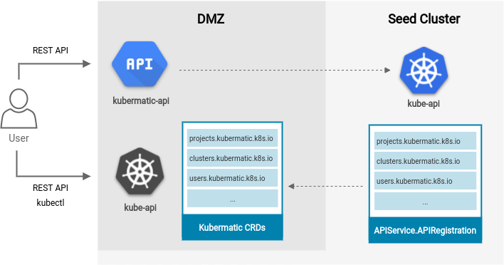

# Kubermatic API through Kubernetes aggregation layer

**Author**: Jan Wozniak (@wozniakjan)

**Status**: Draft proposal; prototype in progress.

## Goals

Discuss alternative approach to Kubermatic API for master/seed cluster operations, that could be delivered with
minimal effort reusing parts of existing codebase and infrastructure.

## Non-Goals

This proposal's purpose is purely to gather feedback and discuss ideas. Only very raw PoC is provided to allow some 
hands-on-experience but it is far from a complete implementation.

## Motivation and Background

Recently, it has been identified that Kubermatic API follows imperative design paradigm, however, it would be desirable
to rather make it follow a declarative design paradigm.

The definitions of imperative vs. declarative paradigms with regards to API design currently don't have canonical and
universally accepted source yet and differ in various articles, publications, and sources[^1][^2][^3][^4].
Therefore, for the purposes of this proposal and following discussion, I would like to redefine both API design paradigms
as I understand them being used here at Kubermatic.

Properties of *imperative* API:
* Users call API endpoints to take certain actions
* Requests are handled synchronously - API calls block until result is available

Properties of *declarative* API:
* Endpoints declare desired state, the system is responsible to identify required actions
* Requests are handled asynchronously - API calls return immediately and system eventually reconciles actual state to desired state

Some of the properties are already natively implemented by `kube-apiserver`, but exposing entire kubernetes API
for KKP seed/master cluster is considered insecure and difficult to maintain. There is a feature of `kube-apiserver` 
we can leverage without jeopardizing security - aggregation layer[^5]. During discussion around KKP3 and KKP4,
it was mentioned that custom aggregation API server is difficult to write but it doesn't need to be thanks
to CRDs and chaining `kube-apiservers`.

## Proof of Concept

It is possible to chain multiple `kube-apiserver` instances using aggregation layer[^5]. The CRDs that are intended for
end user interaction can reside in a `kube-apiserver` with own etcd backend and exposing only paths that 
we would like the users to be able to reach. The aggregated main internal `kube-apiserver` can forward requests for 
matching GVK through `APIService.APIRegistration`[^6] to the extension `kube-apiserver`.

The user facing external `kube-apiserver` in the DMZ can have own dynamic admission control, authentication as well 
as authorization. To lock it down even further, we can disable standard API groups from even being served using
`--runtime-config`[^7].

A similar proof of concept has been deployed to `europe-west3-c` seed cluster to namespace `jw-api-test` for
evaluation and hacking purposes. Code for the deployment and tools developed to support this are available
at [wozniakjan/cluster-wh](https://github.com/wozniakjan/cluster-wh). For the ease of deployment and cleanup, 
alternative `dmzclusters.kubermatic.jw.io` CRD is used instead of `clusters.kubermatic.k8s.io` and a 
`MutatingWebhookConfiguration` provides conversion between the two CRDs, but the pattern would be exactly
the same if using the original kubermatic CRD.

[^1]: https://blog.ipspace.net/2021/01/imperative-declarative-bs.html#:~:text=Declarative%20APIs%20are%20the%20key,%E2%80%9Cintent%2Dbased%E2%80%9D%20networking.&text=In%20computer%20science%2C%20declarative%20programming,without%20describing%20its%20control%20flow.
[^2]: https://edward-huang.com/distributed-system/programming/2021/02/28/why-you-should-always-design-your-api-declaratively-instead-of-imperative/
[^3]: https://www.twilio.com/blog/2017/05/declarative-apis.html
[^4]: https://www.meshcloud.io/2021/08/02/should-i-provide-a-declarative-api-you-propably-should/
[^5]: https://kubernetes.io/docs/tasks/extend-kubernetes/configure-aggregation-layer/
[^6]: https://kubernetes.io/docs/reference/generated/kubernetes-api/v1.19/#apiservice-v1-apiregistration-k8s-io
[^7]: https://github.com/kubernetes/kubernetes/blob/655c04d9f530e5ebc2ec6f5feef76716c8a9db22/staging/src/k8s.io/apiserver/pkg/server/options/api\_enablement.go#L45-L53
