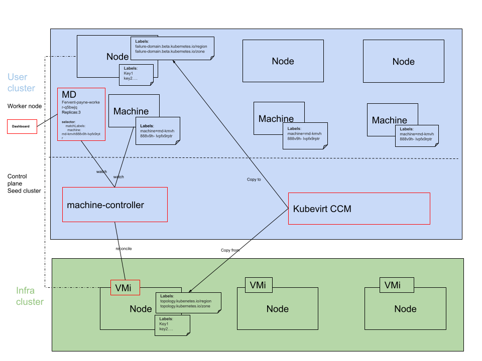

# Production-ready KubeVirt

**Author**: Helene Durand (@hdurand0710)

**Status**: Draft proposal

**Issues**:

* https://github.com/kubermatic/kubermatic/issues/8742


## Table of Contents

- [Motivation and Background](#motivation-and-background)
- [General Architecture](#general-architecture)
- [Proposal for MachineDeployment manifest](#proposal-for-machinedeployment-manifest)
- [VirtualMachine impact](#virtualMachine-impact)
- [Control of VM placement over infra cluster nodes](#control-of-vm-placement-over-infra-cluster-nodes)
- [Impact on Dashboard](#impact-on-dashboard)
- [Control of user cluster pod placement over infra cluster nodes](#control-of-user-cluster-pod-placement-over-infra-cluster-nodes)
## Motivation and Background

In our current offer, there is no control on the placement of the KubeVirt VMs on the underlying nodes. This problem is the same at user cluster level, for the placement of pods.

**This proposal requires some tests/POC. For this, we would need an infra cluster with 2 or 3 nodes (currently, we only have 1).**

## General Architecture



On this diagram, all the impacted components are highlighted with a red border and the impact will be discussed in a dedicated section.

The proposal is to constrain the VM to only run on specific infra cluster nodes or to prefer running on specific nodes using:

- nodeSelector
- Affinity and anti-affinity
- Taints and Tolerations

[KubeVirt Reference documentation](https://kubevirt.io/user-guide/operations/node_assignment/#node-assignment)


## Proposal for MachineDeployment manifest

The proposed *MachineDeployment* is (based on current version):
```yaml
apiVersion: cluster.k8s.io/v1alpha1
kind: MachineDeployment
metadata:
  annotations:
    machinedeployment.clusters.k8s.io/revision: "1"
  creationTimestamp: "2022-03-09T07:29:01Z"
  finalizers:
  - foregroundDeletion
  generation: 3
  name: fervent-payne-worker-q5bwjq
  namespace: kube-system
  resourceVersion: "91938"
  uid: 86625b13-ca85-4308-a72b-f75b7763954d
spec:
  minReadySeconds: 0
  progressDeadlineSeconds: 600
  replicas: 3
  revisionHistoryLimit: 1
  selector:
    matchLabels:
      machine: md-kmvh888v9h-lvpfx9rptr
  strategy:
    rollingUpdate:
      maxSurge: 1
      maxUnavailable: 0
    type: RollingUpdate
  template:
    metadata:
      creationTimestamp: null
      labels:
        machine: md-kmvh888v9h-lvpfx9rptr
    spec:
      metadata:
        creationTimestamp: null
        labels:
          system/cluster: kmvh888v9h
          system/project: f8vwtl5w7s
      providerSpec:
        value:
          caPublicKey: ""
          cloudProvider: kubevirt
          cloudProviderSpec:
            cpus: "1"
            dnsConfig:
              nameservers:
              - 8.8.8.8
            dnsPolicy: None
            kubeconfig: ""
            memory: 2Gi
            namespace: default
            pvcSize: 10Gi
            sourceURL: http://10.107.208.71/centos.img
            storageClassName: local-path
            podAffinityPreset: ""                # Allowed values: "", "soft", "hard"
            podAntiAffinityPreset: "soft"        # Allowed values: "", "soft", "hard"
            nodeAffinityPreset:
                type: "soft"                     # Allowed values: "", "soft", "hard"
                key: "foo"
                values:
                - bar1
                - bar2
            nodeAntiAffinityPreset:
                type: "soft"                     # Allowed values: "", "soft", "hard"
                key: "foo"
                values:
                - bar1
                - bar2
          operatingSystem: centos
          operatingSystemSpec:
            distUpgradeOnBoot: false
          sshPublicKeys:
          - ssh-rsa AAAAB3NzaC1yc2EAAAADAQABAAACAQDAhbW8XzTRCQ9FvEGkA6bPvKNCVne5D+l2jfYkNr3Wlmz9vfQwh9PjrWXFVbfRvG/h8HUEIjXV/V4T8g0Vn/xK227O3LsIT/9rdHLKoJrspWZfmEh7ymT8t/tSsnaQ8y/m+xEcRMAWTdqvHKIuWdqisUEyQUwmb+ddH6ZeYV1wf8XtGhd7fSbsuRuZO0cc7b/G3O+dw8+WSvcdF5cSHVGLltNaileXnLYZABEU5NJkyny61RuCKBNmr4Oh1mJE4ZhJlazNtOHfXaixRV2DY98dQSsbei4iiHXX99VmKQAmYjJUKnKU+AlJuucdbIo7UoZcsz7lgHTWOzrL5VugDx2fdMh6PVaOUx/He4coarkyWu10NiDV9Ch6xPmak1VJK13yFiRV+kJqMnU8tyJNdETHm1e2BPp94hmRcfbJrf7UXNugEotPw1zZMqsnPKXsrwYgovJdx5lGuhO3NYfvJkIkDt4Z5gORfCRgAKAZXQQbAjBG3CuvBr6XjCnzhE3J4P7YK30q6eKVAOXX4g8wOdl3sHt0CgWrPDU7YuFlEROteF/yIVG5776jqaJu4Nvcg2iyW5cA0GANsNqqP6vQTEIbsK24SCn7LD8Kjyy9LJnH4qm03pEIDXvpAT8VJRtQWLL5QHW1RmymHSjJgrEl2TSeqBO+jO2es8eqJrld4Vzxlw==
            helenedurand@Helenes-MacBook-Pro.local
      versions:
        kubelet: 1.21.10
status:
  availableReplicas: 2
  observedGeneration: 3
  readyReplicas: 2
  replicas: 3
  unavailableReplicas: 1
  updatedReplicas: 3
```


The added *providerSpec* part is:

```yaml
            podAffinityPreset: ""                # Allowed values: "", "soft", "hard"
            podAntiAffinityPreset: "soft"        # Allowed values: "", "soft", "hard"
            nodeAffinityPreset:
                type: "soft"                     # Allowed values: "", "soft", "hard"
                key: "foo"
                values:
                - bar1
                - bar2
            nodeAntiAffinity:
                type: "soft"                     # Allowed values: "", "soft", "hard"
                    key: "foo"
                    values:
                    - bar1
                    - bar2
```
which is a facade to the VMi *podAntiAffinity, podAffinity and nodeAffinity* specification.


## VirtualMachine impact

The *machine-controller* will spawn a VMi with the following specification:

```yaml
apiVersion: kubevirt.io/v1
kind: VirtualMachine
metadata:
  annotations:
  labels:
    kubevirt.io/vm: prow-e2e-kubevirt-centos-1.22.5-7ljx725j-worker-q6h88-7d78kw5pl
  name: prow-e2e-kubevirt-centos-1.22.5-7ljx725j-worker-q6h88-7d78kw5pl
  namespace: kube-system
  resourceVersion: "72190267"
  uid: 4034c48c-f61c-43bb-ab43-6c59e41d8605
spec:
  dataVolumeTemplates:
# ...  no change
  template:
    metadata:
      creationTimestamp: null
      labels:
        kubevirt.io/vm: prow-e2e-kubevirt-centos-1.22.5-7ljx725j-worker-q6h88-7d78kw5pl
    spec:
      affinity:
          # Section podAntiAffinity present if:
          #         MD.providerSpec.value.cloudProviderSpec.podAntiAffinityPreset != ""
          podAntiAffinity:
            requiredDuringSchedulingIgnoredDuringExecution:      # if podAntiAffinityPreset = "hard"
            # preferredDuringSchedulingIgnoredDuringExecution    # if podAntiAffinityPreset = "soft"
              - labelSelector:
                  matchExpressions:
                    - key: machine
                      operator: In
                      values:
                        - md-kmvh888v9h-lvpfx9rptr              # A new label to add common to all VMi from the same MD
                                                                # We can re-use machine.metadata.labels: machine=md-kmvh888v9h-lvpfx9rptr
                                                                # already common to all machine from the same MD
                topologyKey: topologyKey:kubernetes.io/hostname
            # Section podAffinity present if:
            #        MD.providerSpec.value.cloudProviderSpec.podAffinityPreset != ""
            podAffinity:
              requiredDuringSchedulingIgnoredDuringExecution:        # if podAffinityPreset = "hard"
              # preferredDuringSchedulingIgnoredDuringExecution      # if podAffinityPreset = "soft"
                - labelSelector:
                    matchExpressions:
                      - key: machine
                        operator: In
                        values:
                          - md-kmvh888v9h-lvpfx9rptr
                  topologyKey: topologyKey:kubernetes.io/hostname
            # Section nodeAffinity present if:
            #         MD.providerSpec.value.cloudProviderSpec.nodeAffinityPreset.type != ""
            nodeAffinity:
              requiredDuringSchedulingIgnoredDuringExecution:       # if nodeAffinityPreset.type = "hard"
              # preferredDuringSchedulingIgnoredDuringExecution     # if nodeAffinityPreset.type = "soft"
                nodeSelectorTerms:
                - matchExpressions:
                  - key: foo
                    operator: In
                    values:
                    - bar1
                    - bar2
            #### same goes for nodeAntiAffinity
      dnsConfig:
        nameservers:
        - 8.8.8.8
      dnsPolicy: ClusterFirst
      domain:
      ####... no change
```


In order to have a *podAffinity* and *podAntiAffinity*, we need a common label among the *Machine* as we reconcile and watch the *Machine*.
We already have a common label among the Machines from the same *MachineDeployment*, which is:
```yaml
machine: md-<machine id>
```
We just need to add this label to the *VirtualMachineInstance*.


## Control of VM placement over infra cluster nodes

**The admin is responsible of labelling the infra cluster nodes**

Based on those existing infra cluster node labels, and with the facade defined in the MachineDeployment manifest and the VMi specification, we can have a quite flexible way of controlling the placement of the VMi on the infra cluster nodes.

## Impact on Dashboard

This change requires an update of the dashboard to enter those values:
- podAffinityPreset
- podAntiAffinityPreset
- nodeAffinityPreset type
- nodeAffinityPreset key and values
- nodeAntiffinityPreset type
- nodeAntiAffinityPreset key and values

## Control of user cluster pod placement over infra cluster nodes

Now, if the admin wants to control the placement of the user cluster workload over the infra cluster nodes, using affinity/antiaffinity, the user cluster nodes need to have the needed labels from the infra cluster replicated.

**KubeVirt CCM is already replicating 2 topology labels from the infra cluster to the user cluster nodes:**
- topology.kubernetes.io/region
- topology.kubernetes.io/zone

We can:
- update KubeVirt CCM to copy some extra labels (keys/values)
- create a new operator to do this.


How to define the list of *keys* to copy for KubeVirt CCM / or the new operator.
Constraints:
- It needs to be dynamic, i.e. does not require to restart the KubeVirt CCM if the list is updated.
- This list would be unique (same set of keys) for all MachineDeployments.

This remains an Open Question.


