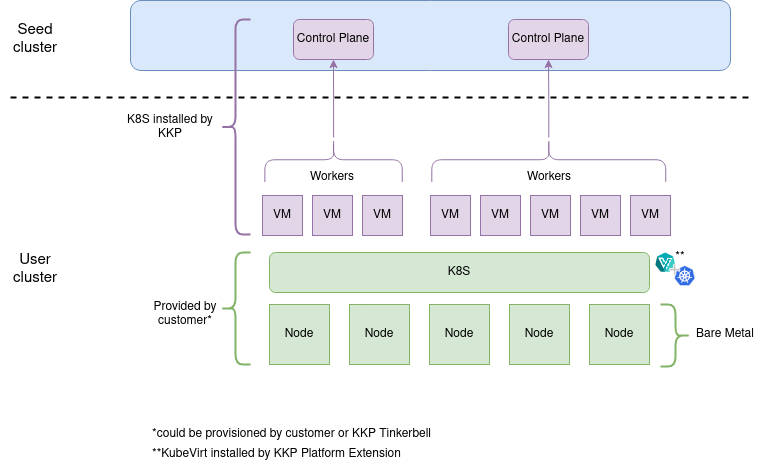
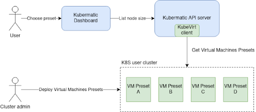
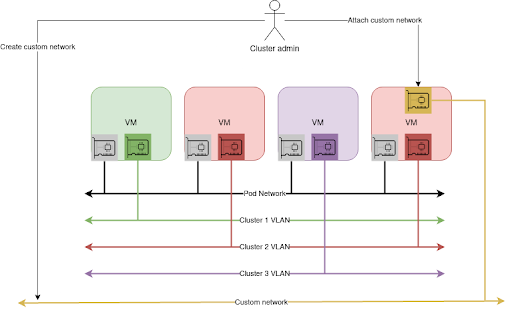
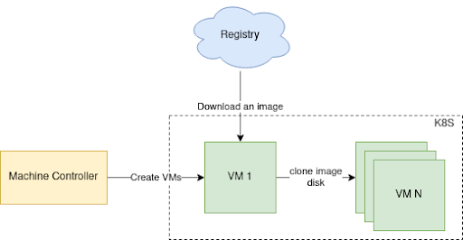
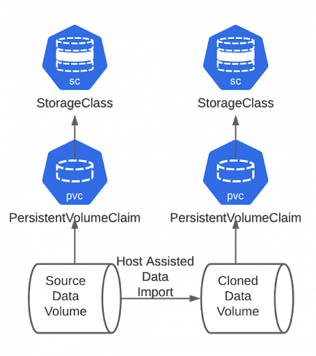
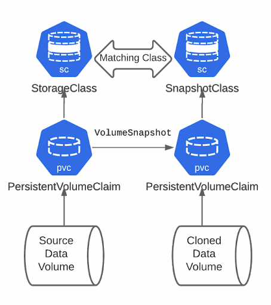

# Production-ready KubeVirt

**Author**: Marcin Franczyk (@mfranczy)

**Status**: Draft proposal

**Issues**: 

* https://github.com/kubermatic/kubermatic/issues/7068
* https://github.com/kubermatic/kubermatic/issues/6516
* https://github.com/kubermatic/kubermatic/issues/6576
* https://github.com/kubermatic/machine-controller/issues/891
* https://github.com/kubermatic/machine-controller/issues/889

## Table of Contents

- [Motivation and Background](#motivation-and-background)
- [General Architecture](#general-architecture)
- [KubeVirt Deployment With Additional Components](#kubevirt-deployment-with-additional-components)
- [Virtual Machines Deployment](#virtual-machines-deployment)
- [Virtual Machines Flavors](#virtual-machines-flavors)
- [Virtual Machine Access](#virtual-machine-access)
- [Network Isolation, Exposure and Performance](#network-isolation-exposure-and-performance)
- [Storage Configuration](#storage-configuration)
- [Monitoring](#monitoring)

## Motivation and Background

In our offer we have KubeVirt as a cloud provider, however, the current state of the product is only good enough
for tests and PoCs, in order to change that we have to make sure that the following points in that document are covered.

**Each section may require some additional benchmarking and testing, this document describes the path
we should take to deliver production-ready KubeVirt, the document should evolve in time.**

## General Architecture

## KubeVirt Deployment With Additional Components

### Overview

The end user would like to have automatic deployment of KubeVirt addon with some additional components like Containerized Data Importer and Multus.
Currently for KubeVirt we are not able to use the KKP addon mechanism because its purpose is not to install more complex projects (simple deployments).
The scope of automation on our side is only limited to the k8s cluster (that means installing only k8s addons).
It is expected that the configured k8s cluster is provided by the customer or KKP bare-metal cloud provider.

### Goals

* Use Platform Extension to install KubeVirt on the k8s cluster provided by users or us over KKP bare-metal cloud provider.
* Use Platform Extension to install other KubeVirt related components like KubeVirt CCM, Containerized-Data importer, GPU operators and more.
* Support offline installation.

### Non-Goals

* Provision user’s environment that is capable of running KubeVirt, that means:
    * Enable virtualization
    * Installation of appropriate kernel modules, KVM
    * Installation of GPU drivers
    * Fine-tune hardware settings that certain features of KVM are supported

### Prerequisites

* The Platform Extension project (current status: to-do proposal)

### Implementation

The KubeVirt extension that includes the Containerized-Data Importer project must be implemented for the Platform Extension.
Once a user chooses KubeVirt as a cloud provider the extension must be installed on k8s cluster.
Access for the under-lying k8s cluster should be provided over kubeconfig (as it is right now).

## Virtual Machines Deployment

### Overview

Machine Controller is already capable of running KubeVirt Virtual Machines, however,
we must guide users a bit and allow them to make the deployment process easier.

We will provide two ways of creating Virtual Machines, use the template already created by us
or create your own custom template.

### Goals

* Allow users to choose a VM pre-defined template or custom template
    * Pre-defined templates https://kubevirt.io/user-guide/virtual_machines/presets/
        * More about the templates in the Virtual Machines Flavors section
* Fine-tune or allow users to change:
    * Storage settings:
        * Allow to add multiple Data Volume disks
        * Rename PVC size to Disk size (more user-friendly)
        * Assign a default storage class to VM
        * List all available storage classes
    * Operating system settings:
        * Improve selection, list all available and supported cloud images
    * Performance settings:
        * Allow to modify all crucial KubeVirt performance settings (only custom template)
            * More about it in the Virtual Machine Flavors section 
    * Resource settings:
        * Allow to change CPU (only custom template)
        * Allow to change memory (only custom template)
    * Virtual hardware settings (only custom template)
* Discard settings like:
    * Virtual Machine deployment namespace
        * We must decide in which namespace VM will be created,
          that represents a scenario with multiple KubeVirt cluster on the same k8s underlying cluster

### Non-Goals

* Virtual Machine ReplicaSet support
* Support for KubeVirt volumes other than Data Volume

### Implementation

Machine Controller, Kubermatic API and Kubermatic Dashboard already support VMs custom resource,
we have to fine-tune the implementation to add extra options that will cover the above points.

## Virtual Machines Flavors

*Note: this section requires benchmarking, the outcome might be an adjustment for points described below*

### Overview

We must provide generic templates for virtual machines that users can use.
This is going to be useful for customers that don't have deep knowledge of virtualization,
it should cover most of the use cases. For more advanced users we should allow the creation of custom VMs and
support all features that KubeVirt provides regarding performance and scalability.

### Goals
* Provide KubeVirt VirtualMachinePresets that are accessible for users
* Allow users to create their own custom virtual machines
* Set appropriate QoS for VMs
* Create templates with high performance
* Consider the below points to prepare VMs templates for high-performance and high-density (oversubscribed) scenarios:
  * General:
    * Check MSI vectors limit, each virtio device or PCI device requires a vector, limit is ~200
  * CPU:
    * CPU pinning, we should leave 1-2 cores for the host tasks (only high performance)
        * We are limited to k8s CPU manager
    * Allow oversubscribing (only high density)
        * Disables CPU pinning
  * Memory:
    * Support for 2MB huge pages
        *  Should be disabled for database nodes
    * Enable KSM (Kernel same-page merging)
        * Can increase a CPU usage
    * Enable Swap
        * Can lead to unpredictable performance of a node in case the node's memory is under pressure, eviction mechanism may not work
        * Generally it is not recommended for k8s workload but can be useful combined with KSM
    * Ballooning
        * Not supported by KubeVirt yet
    * Overcommit management
        * KubeVirt does not support it in a classical way, VMI cannot give back memory that was allocated
    * Consider that each VM has slightly higher memory overhead than requested because of IOThreads, video adapters and more
  * Network:
    * Enable virtio-net multiqueue
        * If not using SR-IOV
        * Can cause a performance degradation for outgoing traffic
        * Can increase CPU usage
        * Must be enabled by an admin on a guest OS for each NIC
    * Support for SR-IOV (only high performance)
  * Storage:
    * Always set disk device cache to `none` if file system supports `O_DIRECT` flag
        * Bypass host buffer cache, guest already contains the cache
    * Set IOThread shared (only high performance)
        * Avoid using main qemu process to submit IO to the host, it will be a different thread
    * Set dedicated IOThread (only high performance)
        * Intensive disk usage, like database node
    * Set dedicated CPU for Qemu Emulator thread (only high performance)
        * Improves vCPUs latency, has to be combined with dedicated cpu placement option
    * Set virtio-blk multiqueue
        * vCPUs == number of queues, that disables moving data between cores, each vCPU has its own queue
    * Allow NVMe devices passthrough (only high performance)
        * Critical IO workload

### Non-Goals

* Guarantee performance of VMs created by user if settings were not discussed with us
* Allow live migration
  * In the future we want to support live migration
* Support anything different from x86 (at least for the initial stage)

### Implementation

We will create a KubeVirt PoC cluster in which we will have to conduct benchmarking tests.
Based on the results from the test we must create standard Virtual Machines Presets.

Next step is to implement a client for KubeVirt that will consume KubeVirt presets from user clusters,
this includes extending the Kubermatic API with KubeVirt VM Size (similar to AWS Size).
In the near future the goal is that all VM presets can be deployed by Platform Extension, currently it must be done by the cluster administrator.

General overview of listing available VMs:

## Virtual Machine Access

### Overview

Cluster administrators must have access to KubeVirt Virtual Machines that are used as nodes for upper-lying k8s clusters.
Currently, KubeVirt offers console access to VMs over virtctl client. The connection is going through an api-server directly
to the VM so there is no need to expose the VM itself. In addition to that we must support SSH access for VMs.

### Goals

* Support serial console access for VMs
* Support graphical console access for VMs
* Support SSH access for VMs:
    * Create a pod with ssh client (access from inside the cluster)
    * Expose VMs as a node port service
    * Configure a pool of external IPs and assign to VMs
    * Configure additional network and add appropriate NICs to VMs

### Implementation

Virtctl app already provides serial console and graphical console access, we just have to document it (or refer to the KubeVirt documentation).

For SSH support:
* Configure a pool of external IPs and assign to VMs
* Configure an additional network and add appropriate NICs to VMs

we have to deploy Multus on the k8s user cluster and configure appropriate networks that are later attached to VMs.
More details about standard configuration are covered in the Network section.

## Network Isolation, Exposure and Performance

### Overview

Currently, when multiple users want to create new KubeVirt clusters, VMs are being deployed on the same network without any isolation.
That brings security and performance concerns. Additionally, as a user I would like to be able to attach custom interfaces to VMs.

### Prerequisites

* Multus must be installed on the K8S user cluster.

### Goals

* Create standard network settings that are default and match with points:
    * Each cluster created by a user must have its own VLAN
* Allow to add a new network to VM
    * Including support of SR-IOV
* Support service exposure from the clusters created on top of KubeVirt cluster

### Implementation

#### Isolation

General overview of the standard network setting with a possibility to add custom NICs to VMs:

VMs in the same cluster will be attached to the same VLANs and communication VM to VM (for the same KubeVirt cluster) 
should go through the VLAN not over the pod network, pod network is only attached to expose the VM as a service.
We should set appropriate pod network policies and routing tables on VMs to achieve the isolation goal.

We must prepare a standard Network Attachment Definition template that is later attached to [Virtual Machines Presets](#virtual-machines-flavors)
with a possibility to add custom NICs (that is covered in the [deployment section](#virtual-machines-deployment)) and figure out 2-3 standard scenarios that
cover NAD setup from the node perspective (usage of bridge, veth etc.).

#### Upper Cluster Exposure

To expose service from the upper cluster (k8s cluster created on top of KubeVirt) we have to deploy [KubeVirt CCM](https://github.com/kubevirt/cloud-provider-kubevirt) as a standard KubeVirt’s component.
The final goal is to deploy the CCM over Platform Extension, however, it is in to-do phase, look at the [deployment section](#kubevirt-deployment-with-additional-components).

#### Underlying Cluster Exposure

We can recommend and support metal-lb deployment in case a customer does not have a possibility (or does not want to) to use a self-provisioned edge.
We have to set appropriate metal-lb setup that we would support based on benchmarking.

#### Performance

We will do benchmarking tests to check which CNI provider is the best for KubeVirt scenario,
Cilium looks promising since it uses eBPF thus it bypass iptables rules, some research must be done in that area to know the limitations and benefits.

## Storage Configuration

### Overview

We already use Containerized-Data Importer together with Data Volume, although each time we create a Virtual Machine we download an image.
We have to change that state to clone images after the first download, or use pre-allocated Data Volumes,
as well we have to use libvirt to attach disks to nodes instead of using NFS directly inside VMs.

### Prerequisites

* Containerized-Data Importer

### Goals

* Support for hot-pluggable disks to avoid attaching NFS storage directly to the VM.
* Support for Data Volume registry 
  * Host assisted data clone
  * Snapshot data clone (not every CSI driver and storage support this)
* Provide optimal storage setup that work together with KubeVirt, it is about a document or support for storage solutions
  we choose (customers often ask about that), like CEPH, Quobyte etc.

### Non-Goals

* Allow crossed namespace Data Volume registry
* Support for live migration 
    * In the future we want to support live migration

### Implementation

By default the Machine Controller after the first VM creation should change the Data Volume template to use the cloning mechanism of CDI to create other VMs.

Also we should implement support for pre-allocated data volumes. Users should have a possibility to pick appropriate Data Volume
from the dashboard that they would like to attach to VMs.

In addition to the above points we must document the difference between smart-cloning and host-assisted,
users should be aware when smart-cloning is possible and in which conditions it can be launched.

Host assisted cloning:

Smart cloning:

Optimal storage solution:
* Document in to-do phase

## Monitoring

### Overview

KubeVirt relies on Prometheus thus we can get metrics sent by KubeVirt VMIs and collect them with MLA.

### Goals

* Integrate KubeVirt with MLA

### Implementation

The best would be to rely on the KKP Prometheus deployment and add appropriate annotations to KubeVirt services to scrape VMI metrics.
Additionally, cloud-init must install the node-exporter inside the VMI (we are interested in VMI metrics not pods).
