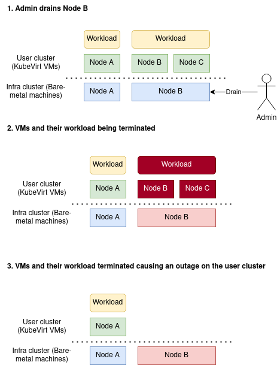

# KubeVirt cloud provider - workload eviction

**Author**: Marcin Franczyk (@mfranczy)

## Motivation and Background

KubeVirt cloud provider cannot handle bare-metal node eviction.
Each time it happens, VMs (user cluster nodes) and their workload are terminated immediately.
It’s required to introduce a safe mechanism to prevent immediate workload kill and support graceful eviction.

### Goals
* Prevent instant workload termination of VMs (user cluster nodes).

### Illustrated problem

### Implementation

Create a kubevirt-vmis-eviction controller that is a part of the user-cluster-controller and
intercepts VMI’s eviction status.  The controller should run only if the cloud provider is KubeVirt.

1. Machine Controller should create Virtual Machines with: **spec.template.spec.evictionStrategy: External**.
   1. That will block VMs eviction till it’s handled properly by kubevirt-vmis-eviction controller.
2. Kubevirt-vmis-eviction controller should read KubeVirt kubeconfig from secrets that are already provided by end user.
3. The controller should watch for VMIs in the cluster namespace at KubeVirt infra cluster, and observe **status.evacuationNodeName** field.
4. Finally, the new controller should delete corresponding Machine object on the user cluster.
   1. VMI’s name is equal to Machine’s name.
   2. Pods eviction from VM node will be handled by
   [Machine Controller’s eviction mechanism](https://github.com/kubermatic/machine-controller/blob/main/pkg/node/eviction/eviction.go#L55).
