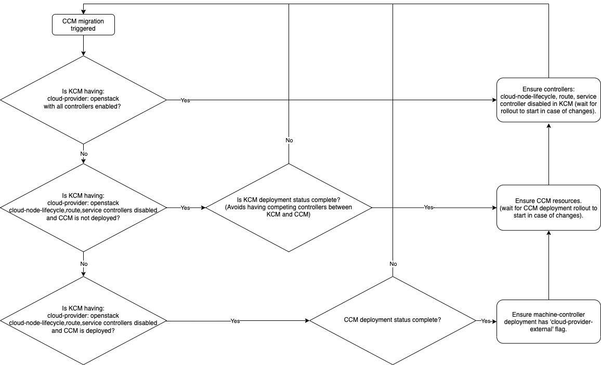

# Migrate OpenStack clusters to external CCM

**Author**: Iacopo Rozzo, Youssef Azrak

**Status**: Draft

Currently user cluster created with Kubernetes version greater or equal to 1.17
and OpenStack provider, are configured with external CCM (cloud controller
manager). The clusters created with versions older than 1.17 before this
feature was introduced are still using the in-tree cloud-provider and no
migration path is provided.

## Goals

* Migrate existing clusters from in-tree cloud provider to external CCM.
* Migrate existing clusters from in-tree cloud provider to Cinder CSI plugin.

## Non-Goals

* Provide a fallback mechanism after migration is triggered.
* Define how to trigger the migration using UI/API.

## Terminology

* `CCM`: Cloud Controller Manager
* `CSI`: Cloud Storage Interface, in the context of this document we use CSI to
  indicate the CSI plugin.
* `KAS`: Kubernetes API server.
* `KCM`: Kubernetes Controller Manager

## Implementation

To trigger the migration we would rely on the existing feature gate
`ExternalCloudProvider`, but to gain more control two new feature gates
allowing to enable external CSI and CCM independently, will be introduced:

- `ExternalCCM`
- `ExternalCSI`

### CCM Migration

The migration path includes different stages, to avoid overlaps between
functionalities provided by the CCM and other components like KAS, KCM and
Kubelets.

The reconciling logic of the `cluster_controller` in the
seed-controller-manager has to be enhanced to detect wheter a migration was
triggered and determine the stage of the migration in order to apply the
required adjustments to the resources involved (KAS, KCM, CCM).

The logic to determine the stage would be delegated to a dedicated controller,
and the `cluster_controller` would retrieve the information from the cluster
status.

The details of the logic used to detect the migration are left to the
implementation, but it could consist in checking if the ExternalCloudProvider
or one of the newly introduced feature gates are enabled in the cluster and 
if KAS or CCM still have the `cloud-provider: openstack` flag in their manifest
arguments. 

The steps of the migration are summarized in the flowchart below.

  

TODO(irozzo): This flow implies that for some time the `cloud-node` controller
is running besides some kubelets still having `cloud-provider=openstack`,
double check that this is safe. 

### CSI Migration

The Cinder CSI plugin manifests are not deployed by `cluster-controller`, but
the `addons` mechanism is used instead. This is mainly because an agent has to
be deployed on every node through a DaemonSet.

Enabling `ExternalCloudProvider` or `ExternalCSI` feature gates will deploy
the manifests (for the latter we have to add a condition [here][csi-addons]).
Note that the CSI can be deployed alongside the in-tree provider,
the only problem is that the default storage class should be changed to use the
CSI provisioner instead of the in-tree provider, and addons mechanism does not
allow us to do this easily.
To address this point we can use one of the two following approaches:
- Deploy the two storage classes and remove the default annotation from the old
  one.
- Require a manual operator intervention to remove or remove the default
  annotation from the old storage class.

In addition to that KAS, KCM and `machine-controller` manifests should include
the following feature gates:

`"CSIMigration=true,CSIMigrationOpenStack=true,ExpandCSIVolumes=true"`

A similar logic to the one described in the CCM migration section can be used
to distinguish between a fresh install and a migration.

### Final step

The final step consisting in rolling out the machine-deployment is left
to the operator. This is necessary in order for the kubelets be set with the
right flags, as we do not have a strategy to update the flags in place.
Note that even withoug this final step the CCM is fully working.

## Task & effort:

- Add a new controller in the seed controller manager to check whether a
  migration is needed, to determine the migration stage and to update the
  cluster status accordingly. O(5d)
- Update the `cluster-controller` to take into account the migration stage and
  apply the KAS, KCM, CCM and machine-controller manifests accordingly. O(1d)

## References:
[Openstack migration document][openstack-migration]
[KKP CCM/CSI Migration Proposal (internal)][kkp-ccm-migration-proposal]

[openstack-migration]: https://github.com/kubernetes/cloud-provider-openstack/blob/master/docs/openstack-cloud-controller-manager/migrate-to-ccm-with-csimigration.md#migrate-to-openstack-cloud-controller-manager
[kkp-ccm-mitration-proposal]: https://docs.google.com/document/d/1k5zjRANVU2_BnCX_l0ywUPEHYOtFs9JucHZaKI5OzhY/edit#heading=h.c9zkpbwzqq3x
[csi-addons]: https://github.com/kubermatic/kubermatic/blob/17182630f16f91be63811aba2c1f8b5864b7ec95/addons/csi/controllerplugin.yaml#L15
