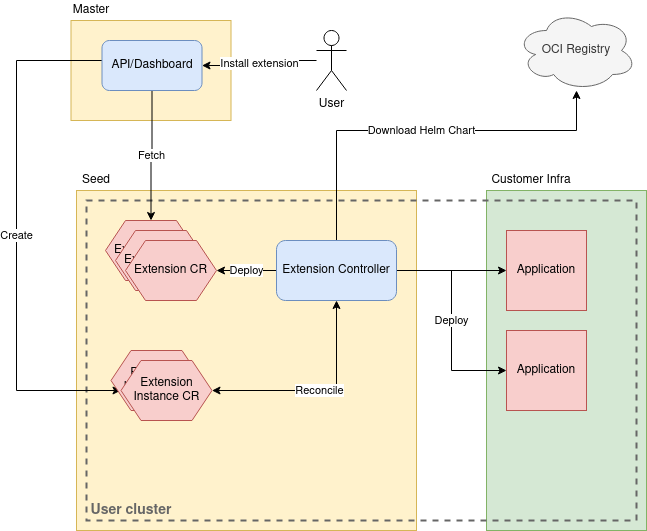

# Platform Extension Implementation: Helm-manager

**Author**: Marcin Franczyk, Sascha Haase, Moritz Bracht, Sankalp Rangare

**Status**: Draft proposal.

## Goals

This proposal is to introduce the implementation for platform-extensions based
on Helm charts.

## Motivation and Background

An implementation of platform-extension based on Helm charts provides flexible
way to manage the lifecycle of platform-extensions, and it overcomes
limitations of current ADDON mechanism. 

[Check this for requirements](./platform-extensions.md#requirements-for-implementations)

## Implementation

In this new mechanism we propose to use Helm-charts to deploy extension and
manage their life-cycle. We include Helm-charts repo information into CRDs and
a Helm-controller watches this CRs to manage extensions.

This mechanism overcomes the [limitations](./platform-extensions.md#limitations)
with existing ADDON mechanism in following ways:

* It's flexible to extend platform-extension using Helm-charts.
* Complex extensions can be deployed easily.
* Helm takes care of resolving dependency between extensions.

### Main Concept Points

* Extensions provided by KKP devs
  * Extensions created as Helm charts
  * All extensions in the same repo `kubermatic/extensions`
    * The repo tags match the k8s version, for instance v1.19, v1.20
* Extensions provided by users
  * Point to Helm registry where to get the charts for these extensions
* Extensions are **not** tied to the KKP lifecycle
* Extensions are tied to the K8s or their own version lifecycle
* Extensions are configurable

### Extension Registration

Similar to AddonConfig and Addon, we add Extension and ExtensionInstance CRDs.
The structure is quite similar, additionally Extension CRD has a source/repo
field to inform the extension-controller about the repository address.

Extension CRD fields: (AddonConfig)
* App version
* K8s version (optional)
* Logo
* Available parameters
* Repo address
  * 1.19: &lt;repo address>
  * 1.20: &lt;repo address>

ExtensionInstance CRD fields:
* Reference to the Extension CR
* Passed parameters
* Status of the extension

### Extension Controller

Reconciles Extension and ExtensionInstance CRs. Runs on each user cluster,
basically it’s a Helm manager. Initially deploys extensions CRs defined in the
cluster template or KKP configuration. Based on the cluster configuration it
allows you to install some extensions by default. It’s responsible for
automatic extensions upgrades during the k8s cluster upgrade.

### Architecture

