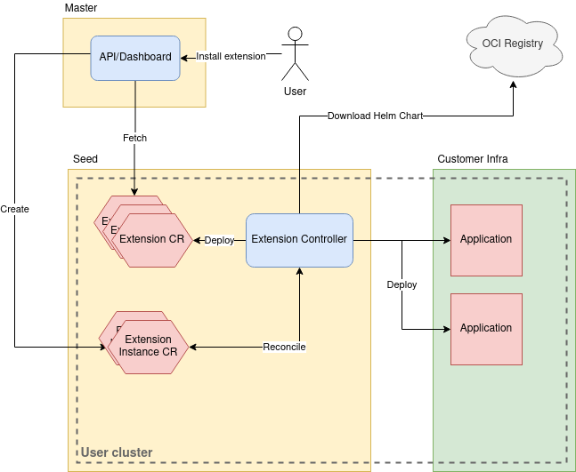

# Platform Extension
**Author**: Marcin Franczyk, Sascha Haase, Moritz Bracht, Sankalp Rangare

**Status**: Draft proposal.

## Goals

This proposal is to enhance the current ADDON/extension mechanism and introduce a new platform-extension mechanism which will provide easier way to manage the lifecycle of extensions.

## Motivation and Background
### Differentiating between KKP AddOns and Platform Extensions
Problem Statement: We want to be able to determine in early stages of development what new feature/s to push and how they can work out from a tech and business perspective. Therefore we gathered some early ideas on how to differentiate between two different yet similar  terms.

Furthermore the following differentiators will allow us to determine if we should invest time & budget into a certain topic and if they intertwine. If a new topic has the potential to generate a standalone revenue stream, development efforts could be much higher and would result in a “platform extension”. There are requirements that we still need to fulfill (often called hygiene features in product management) the complexity and budget associated with it has to be reduced compared to the standalone feature and would result in the Extension mechanic.

### Current Addon Mechanism
#### Main Concept Points

* Default Addons (core addons)
  * Always installed on each user cluster, like
    * Canal
    * Dashboard
    * kube-proxy

* Accessible addons
  * Addons that the user is allowed to interact with.
    * Node Exporter
    * KubeVirt / CDI (implementation dropped because of addon complexity)
    * KubeFlow

* Custom Addons
  * Addons that are installed by default together with core addons. Requires to ship a custom docker image

#### Summary
##### Pros
* Good enough for simple and core deployments that users don’t have a chance to interact with like:
  * kube-proxy
  * CSI drivers
  * OpenVPN

##### Cons
* Difficult to extend
  * Accessible addons shipped as a docker image together with core addons
* Kubermatic upgrade enforce to rebuild the addon image
* Difficult to deploy more complex K8s addons/apps:
  * Since the plugin contains multiple CRDs and their instantiations at the same time, it takes several attempts in reconciliation loop until it is successfully applied. That results into several warnings in the cluster event log in the KKP UI.
  * Since KubeCarrier requires cert-manager to run, cert-manager has to be installed prior to KubeCarrier. If they are both installed at once as part of the same plugin, it takes long time (several minutes) until everything converges and KubeCarrier is ready. Sometimes, KubeCarrier does not even start at all.
* No control over dependencies, the requirement:
  * A KKP addon may be dependent on a different addon (e.g. addon A creates a CRD / resource that addon B instantiates / consumes). An example of this is the KubeCarrier addon, which is dependent on the cert-manger addon, that needs to be deployed in before.

#### Action Items
* Remove accessible addons from KKP and replace them with Platform Extensions
* Drop idea of shipping custom image addons

## Implementation

### Platform Extensions

#### Main Concept Points

* Extensions provided by KKP devs
  * Extensions created as helm charts.
  * All extensions in the same repo kubermatic/extensions
    * The repo tags match the k8s version, for instance v1.19, v1.20
  * Extensions pushed to quay.io/kubermatic-extensions/&lt;extension>:&lt;tag>
* Extensions provided by customers
  * Can point to any OCI registry
  * Customers should keep our tagging pattern
* Extensions are **not** tied to the KKP lifecycle
* Extensions are tied to the K8S or their own version lifecycle
* Extensions are editable

#### Implementation
##### Extension Registration

We add Extension and ExtensionInstance CRDs.
The structure is quite similar, additionally Extension CRD has a source/repo field to inform the extension-controller about the repository address.

Extension CRD fields: (AddonConfig)
* App version
* K8s version (optional)
* Logo
* Available parameters
* Repo address
  * 1.19: &lt;repo address>
  * 1.20 &lt;repo address>

ExtensionInstance CRD fields:
* Reference to the Extension CR
* Passed parameters
* Status of the extension

#### Extension Controller

Reconciles Extension and ExtensionInstance CRs.
Runs on each user cluster, basically it’s a helm manager. Initially deploys extensions CRs defined in the cluster template or KKP configuration. Based on the cluster configuration it allows you to install some extensions by default. It’s responsible for automatic extensions upgrades during the k8s cluster upgrade.

#### Architecture

#### Open questions
