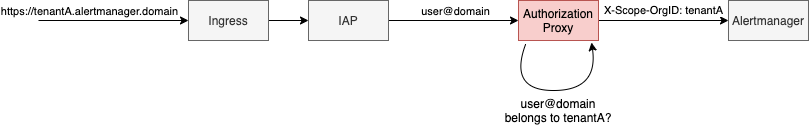

# User-Cluster MLA (Monitoring, Logging & Alerting) & MLA Controller for KKP

**Authors**: Rastislav Szabo (@rastislavs), Jiacheng Xu (@jiachengxu), Pavel Aborilov (@aborilov)

**Status**: Draft proposal, [PoC](https://github.com/kubermatic/mla) in progress.

**Issues**: https://github.com/kubermatic/kubermatic/issues/6321, https://github.com/kubermatic/kubermatic/issues/6397

## Table of Contents
- [Goals](#goals)
- [Motivation and Background](#motivation-and-background)
- [Implementation](#implementation)
  - [User Cluster MLA Components](#user-cluster-mla-components)
    - [Loki Promtail](#loki-promtail)
    - [Prometheus](#prometheus)
  - [Seed MLA Components](#seed-mla-components)
    - [MLA Gateway](#mla-gateway)
    - [Loki\-Distributed](#loki-distributed)
    - [Cortex](#cortex)
      - [Metrics Write Path](#metrics-write-path)
      - [Metrics Read Path](#metrics-read-path)
    - [Alertmanager](#alertmanager)
    - [Grafana](#grafana)
    - [Storage Backends](#storage-backends)
  - [Connectivity Between User Cluster and Seed MLA Components](#connectivity-between-user-cluster-and-seed-mla-components)
  - [MLA Controller in Seed\-Controller\-Manager](#mla-controller-in-seed-controller-manager)
- [Future Work &amp; Enhancements](#future-work--enhancements)
- [Tasks &amp; Effort](#tasks--effort)

## Goals

Provide standardized Monitoring, Logging, and Alerting (MLA) services for User Clusters, that can be used for Managed
Services Offerings. The solution should provide centralized access to logs and metrics of applications running in User
Clusters for the Managed Service Provider team, as well as the end users of the clusters (only for the clusters that
they own/have access to).

The provided solution should be built on standard MLA tools (e.g. Grafana, Prometheus, Loki, Cortex) and should be
easily and automatically installed into User Clusters if the feature is enabled. The dashboards of individual tools
should be easily accessible for the Managed Service Provider team as well as end users and authentication &
authorization should be integrated with KKP.

## Motivation and Background

The KKP already provides the [Monitoring Stack](https://docs.kubermatic.com/kubermatic/v2.15/monitoring/architecture/)
for monitoring and alerting of KKP components running in the Seed Cluster and User Cluster control plane components
running in the Seed Cluster.

The aim of this proposal is to expand the User Cluster monitoring, logging and alerting to applications running in the
User Clusters as well. That includes system components running in the `kube-system` namespace of the User Clusters, as
well as any custom applications deployed in the User Clusters.

The main motivation for that is to support managed services offerings on top of KKP. The managed service provider team
has to easily access logs, metrics and alerts from the User Cluster applications of any tenant from a central dashboard,
to help with debugging and resolving issues in the User Clusters.

The owners/end users of individual User Clusters will benefit from this User Cluster MLA stack as well, as they will be
able to consume the logs & metrics from their User Clusters via convenient dashboards as well - automatically, without
the need to manually install anything into their User Clusters.

## Implementation

The User Cluster MLA implementation will be based on an architecture where all components responsible for storing and
retrieving the MLA data will run in the Seed cluster.

All User Cluster logs and metrics data will be continually sent to the Seed Cluster, where they will be stored in
long-term storage, labeled with tenant ID (mapped to KKP Cluster ID). The Seed Cluster will expose the Grafana UI, which
will be made available to the managed service provider team users (will have access to the data of all User Clusters),
as well as the end users of the User Clusters (will have access only the data of the User Clusters that they own/have
access to).

  

This approach with centralized storage of data from all User Clusters has several advantages: all data is available for
review even after a User Cluster goes offline, the setup in User Clusters is very simple and lightweight
(edge-native). However, it also has several disadvantages: a lot of data has to be continuously sent from the User
Cluster to the Seed Cluster, and there must be a trusted relationship between the User Cluster users and the Seed
Cluster operators.

To address these disadvantages, an alternative “decentralized” approach is proposed as well, which could be used  
even in combination with the previous one for selected clusters. In this approach, each User Cluster will run all MLA
components locally (installed as KKP Addons) and store all MLA data locally as well. That of course brings a need for
much more resources and storage in each User Cluster (as shown on the picture below), and makes maintenance more
complex. The Managed Service Provider users will be able to access the MLA data via the Grafana UI running in the Seed
Cluster, using data sources pointed to endpoints routed via tunnels between the Seed Cluster and User Clusters. Of
course, that may result in slower query speeds, and in case that a cluster is not reachable from the Seed, no MLA data
can be displayed for it.

  

The initial implementation and the rest of this document will be focused on the first (“centralized storage”) approach,
the implementation of the second (“decentralized”) approach will be left for future.

### User Cluster MLA Components

The User Cluster MLA components - Loki Promtail and Prometheus will be automatically deployed into User Clusters by the
User-Cluster-Controller-Manager, based on the `Cluster` CRD object flags `enableLogging` / `enableMetrics` respectively.
These will be automatically enabled for all User Clusters, if the global KKP configuration option `enableUserClusterMLA`
is enabled. That should provide enough flexibility for administrators to selectively disable MLA features for specific
User Clusters.

#### Loki Promtail

Loki Promtail will be configured to automatically scrape logs from all User Cluster pods. The Promtail manifests will be
based on the upstream [Promtail Helm Chart](https://github.com/grafana/helm-charts/tree/main/charts/promtail). Each User
Cluster will have its `client.url` in `promtail.yaml`
set to point to its associated MLA Gateway (described below).

#### Prometheus

Prometheus will be configured to automatically scrape metrics from all User Cluster pods with the well-known
[Prometheus Annotations](https://github.com/prometheus-community/helm-charts/tree/main/charts/prometheus#scraping-pod-metrics-via-annotations).
The Prometheus manifests will be based on the upstream
[Prometheus Helm Chart](https://github.com/prometheus-community/helm-charts/tree/main/charts/prometheus). It
will be configured to do a remote write to its associated MLA Gateway (described below).

### Seed MLA Components

Some of the Seed components are already in place in the Seed clusters - covering Seed cluster monitoring and monitoring
of Kubernetes control plane of individual User Clusters running in the Seed. We aim to integrate with existing
components where possible. These components, except for the MLA Gateways, will be installed using Helm Charts, similar
to how existing monitoring components are installed now.

#### MLA Gateway

The MLA Gateway is the entrypoint for User Cluster to Seed connections, used for streaming the logs and metrics. To
provide higher security and flexibility, we will deploy one MLA Gateway per each User Cluster. The MLA Gateway will be
responsible for the following:

- terminating TLS sessions with logs/metrics streams from the User Clusters,
- mTLS authentication,
- adding HTTP headers with tenant ID (KKP Cluster ID) to individual data streams to guarantee proper multi-tenancy
  (`X-Scope-OrgID` for Loki and Cortex),
- potentially rate-limiting of requests, or disabling the requests per user cluster.

Apart from that, the MLA Gateway will be also used to serve as a Seed Cluster local endpoint for retrieving data (read
path; used as a data source in Grafana) for individual tenants. By adding tenant headers, it will make sure that each
tenant can retrieve only data that belongs to them.

For the MLA Gateway we will use the nginx server with two `server` configuration sections with different ports: one that
will be exposed to the Seed Clusters (for the write path) and one that will be available only locally in the Seed (for
the read path).

#### Loki-Distributed

The Loki manifests will be based on the
upstream [Loki-Distributed Helm Chart](https://github.com/grafana/helm-charts/tree/main/charts/loki-distributed). Loki
stack will be deployed in the Seed Clusters in microservice mode as shown below:

  

The following Loki-Distributed components will be deployed:

- Distributor. Distributor is responsible for handling incoming streams, each stream is validated for the correctness
  and to ensure that it is within the configured tenant. Valid chunks are then split into batches and set to Ingesters.
- Ingester. Ingester is responsible for writing log data to long-term storage backends on the write path and returning
  log data for in-memory queries on the read path.
- Querier. The querier service handles queries using the LogQL query language, fetching logs both from the Ingesters and
  long-term storage.
- Query-Frontend. Query-Frontend provides the querier’s API endpoints and can be used to accelerate the read path.
- Table Manager. Table Manager is a component which takes care of managing tables for table-based storage backends
  (more details in the Storage Backends section).

For more detailed information about Loki components, please refer to
the [loki architecture](https://grafana.com/docs/loki/latest/architecture/) docs.

The Loki-distributed architecture will provide the possibility for easy horizontal scalability, where individual
components can be scaled independently.

#### Cortex

For long-term storage of metrics from Prometheus instances running in the User Clusters with multi-tenant alerting
support, we will use a [Cortex](https://cortexmetrics.io/) deployment in the Seed Cluster as shown on the picture below:

  

##### Metrics Write Path

The Prometheus instances deployed in the User Clusters will be configured to perform remote write to endpoints exposed
via an MLA Gateway per each User Cluster (the same as used for Loki). The Gateways will make sure that the data streams
contain proper tenant headers before forwarding them to Cortex Distributor. [MinIO](https://min.io/) will be used as the
object storage backend for metrics data.

##### Metrics Read Path

The Users will have their data sources pointed to their MLA Gateway, which will enforce proper tenant ID, and this will
make sure that each tenant can only retrieve data that belongs to them.

To provide multi-tenancy alerting
support, [Cortex-Alertmanger](https://cortexmetrics.io/docs/architecture/#alertmanager) and Ruler will also be deployed
as shown on the picture above. Users can config Alertmanager based on their needs, and MinIO will be used for storing
the per-tenant configuration.

#### Alertmanager

As mentioned above, for sending alerts generated from the logs and metrics gathered in the Seed Cluster, we will deploy
a single Cortex-Alertmanager instance. To connect it to the Loki infrastructure, we will deploy a Loki Ruler instance (
which connects to Loki Ingester). The following picture demonstrates the authentication and authorization flow when
users access Alertmanager:

  

For authentication, an IAP (Identity Aware Proxy) will be deployed behind Ingress. When it receives requests from users,
it will authenticate the user and forward the request to the Authorization proxy.

An authorization proxy will be implemented and deployed, and it will perform authorization and permission checks to make
sure only the user who has access to the User Cluster can access the corresponding Alertmanager configuration and UI.

#### Grafana

A centralized Grafana instance with multi-tenancy support will be deployed in Seed.

For authentication, Grafana will be configured to use the Dex instance running in the Seed Cluster as an OIDC provider.

To enable multi-tenancy, KKP projects will be mapped
to [Grafana Organizations](https://grafana.com/docs/grafana/latest/permissions/organization_roles/). For every cluster
within a KKP project, logs and metrics data sources pointing to the respective MLA Gateways will be added to Grafana
within the organization. The regular users won’t be able to manage data sources in Grafana, therefore they will be
restricted to only see logs & matrics matching their organization. Also, Grafana can be configured with different
permission levels (admin / editor / viewer) for different users according to their permission levels in the KKP project.

For Managed Service Provider users (superusers), who should be able to access data of all Customer Clusters, a superuser
Grafana organization will be created. The organization will have to be configured with multiple Loki and Cortex data
sources off all User Clusters.

#### Storage Backends

For long-term storage of logs, Loki-Distributed needs to use different storage backends for two types of data: log
indexes and log chunks. Similarly, Cortex also requires storage backends for metrics indexes, metrics chunks, and
Alertmanager configurations.

For index storage, we will use [Apache Cassandra](https://cassandra.apache.org/) deployed in Seed to provide a
table-based storage backend compatible with any cloud provider. The Table Manager components of Loki-Distributed and
Cortex need to be deployed for it, to take care of database schema creation.

For log chunks, metric chunks and Alertmanager configurations, we will use [MinIO](https://min.io/) as the object
storage backend. Since MinIO is already running in Seed as part of the existing monitoring stack, we may just reuse it.

For both storage backends, we will use the `kubermatic-fast` Storage Class available in the Seed.

### Connectivity Between User Cluster and Seed MLA Components

Each User Cluster will be connected to a separate MLA Gateway running in Seed (in the User Cluster namespace). The same
Gateway will be used to serve both Prometheus and Loki connections. Therefore, the write path MLA Gateway endpoints for
a User Cluster have to be reachable from the User Cluster itself.

For the initial implementation, we will leverage the existing
KKP [expose strategies](https://docs.kubermatic.com/kubermatic/master/architecture/concepts/expose_strategy/) that
are used for exposing Kubernetes control plane services to user clusters for exposing the MLA Gateway. Depending on the
strategy used in the Seed it would be one of:
- `NodePort` - would allocate one more NodePort for MLA per user cluster,
- `Global LoadBalancer` / `One LoadBalancer Per User Cluster` - would allocate one more listener on the LoadBalancer per
user cluster + one more NodePort per user cluster,
- `SNI` (part of
the `Tunneling` [expose strategy](https://github.com/kubermatic/kubermatic/blob/master/docs/proposals/http-tunnel-expose-strategy.md)) - would
  not allocate more LB listeners nor NodePorts. The User Cluster would be connected to a MLA-specific HTTPS
  endpoint for the given cluster, e.g.,  `https://mla.<<cluster-id>>.<<seed-cluster-name>>.base.domain`.

For this connectivity strategy, all that is needed from an implementation perspective is a
proper `nodeport-proxy.k8s.io/expose` annotation on the MLA Gateway Deployment resource.

As a potential enhancement, we could consider expanding on
the [tunneling expose strategy](https://github.com/kubermatic/kubermatic/blob/master/docs/proposals/http-tunnel-expose-strategy.md),
and tunneling the MLA traffic through the tunneler agents running on the User Cluster worker nodes to reduce the total
amount of HTTPs connections between the User Cluster and the Seed Cluster (as one Loki Promtail runs on each node in the
User Cluster and opens its own connection to the Gateway).

### MLA Controller in Seed-Controller-Manager

To automate the configuration of Seed components, we will introduce a new controller into the Seed-Controller-Manager.
The MLA Controller will manage the following components in the Seed:

- MLA Gateway:
    - Deploys & configures one MLA Gateway per each User Cluster.
- Grafana:
    - Configures a Grafana Organization for each KKP Project.
    - Adds / removes users to / from Grafana Organizations when users are added / removed to / from KKP Projects.
    - Configures data sources for individual User Clusters in Grafana Organizations and in the Superuser Organization.
- IAP:
    - Deploy and Configures one Ingress and configures IAP per each User Cluster.

## Future Work & Enhancements

This proposal does not cover some advanced topics that are left for future enhancements, such as:

- “Decentralized” MLA approach as described in the Implementation section.
- Lightweight User Cluster agents for edge use-cases (Grafana Agent).
- Automatic cleanup of outdated data / data of deleted tenants.
- Customization of scrape targets per User Cluster for Loki / Prometheus
- Auto-scaling of MLA components in the Seed with the amount of User Clusters / nodes of User Clusters.
- Integration with the existing monitoring stack and the upgrade procedure for existing KKP installations.
- Automated Grafana Dashboard creation.
- High Availability Grafana setup.
- Automated backups of data.

Alternatives Considered The Implementation section covers an alternative - “Decentralized” approach. Although it is very
valid, it is left for the future.

Also, we are still looking into how
to [migrate from Prothemeus to Cortex](https://cortexmetrics.io/docs/blocks-storage/migrate-storage-from-thanos-and-prometheus/).
Since we will use Cortex for User-Cluster MLA stack, it could not be integrated with the existing KKP monitoring stack
easily.

## Tasks & Effort

(for the centralized storage approach)

- MLA stacks in Seed (10d)
    - Create microservice-based Loki deployment for Seed
    - Create Cortex deployment for Seed
    - Create multi-tenant Grafana deployment for Seed
- MLA resources in User Clusters (5d)
    - Create Resources for Loki Promtail + Prometheus (sending data to Seed)
    - Add flags to Cluster CRD/API object to enable/disable Promtail + Prometheus installation in user clusters
- MLA controller (10d)
    - Create MLA controller in KKP - Automate Grafana configuration
    - Multi-tenancy support for Grafana in the MLA controller
    - Expose dedicated MLA Gateway per each user cluster
    - Expose dedicated Ingress and configure IAP per each user cluster
- Networking (5d)
    - Expose MLA Gateway using KKP expose strategies
    - Enable mTLS Authentication on MLA Gateways
- Integration with KKP (10d)
    - Proposal for integration with the existing Seed monitoring stack and KKP installer